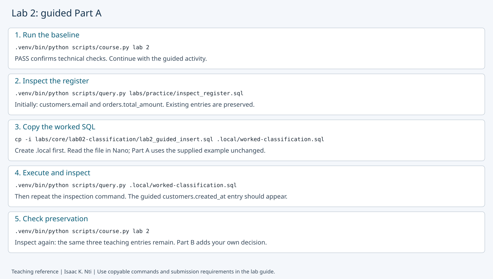

# Lab 2: Classification and stewardship

**Outcomes:** SLOs 1,5. **Estimated time:** 45–60 minutes; allow additional time for installation and support.
**Environment:** your dedicated local course database. Synthetic data only.

## At a glance

| Before starting | Lab 1 and the configured environment |
| --- | --- |
| You will run | Initialize and inspect the register; insert a guided and independent entry. |
| You will write | Two classification decisions and the requested register evidence. |
| Done when | The entry is verified and your governance rationale is recorded. |
| Safe stopping point | After a completed section; save your draft before closing the editor. |

Follow the steps below in order. Keep configuration, generated logs and submissions private.
Return to the [required course path](../../../docs/course_checklist.md) when this lab is complete.

## Progress checklist

- [ ] [Part A](#part-a-follow-the-worked-example-unchanged): follow the example and record the requested interpretation.
- [ ] [Part B](#part-b-apply-the-method-independently): make your independent change and verify its result.
- [ ] [Part C](#part-c-submit-evidence-and-reasoning): assemble the listed evidence once.

You may complete one part per session. Read the current step, run its command,
then check its expected result before moving on. Reference images and recovery
notes are support, not extra submissions.

## Why this lab matters

A data administrator needs to explain who owns a field, why it is used, how
sensitive it is and what restrictions apply. A governance register makes those
decisions visible for review. In this lab, you record decisions for synthetic
retail data and distinguish documented policy from an enforced database control.

## Learning objectives

These instructor-developed lab objectives support the course outcomes above.
By the end of this lab, you should be able to:

- Classify a field using its purpose, sensitivity and potential harm.
- Insert and inspect a governance-register entry using a provided SQL pattern.
- Justify ownership, retention assumptions and permitted AI use.
- Explain why recording a policy does not enforce it.

## Skills you will practice

Read a simple SQL INSERT, edit a private SQL file in Nano, execute it with the
course query helper, interpret JSON results and verify that an entry survives a rerun.
No prior INSERT-writing experience is assumed; complete the guided example first.

## What you will produce

A guided example observation, two independent written field classifications,
one original register entry with before/after evidence, and a short explanation
of your decisions and their limits. Use the submission checklist at the end.

## Before you begin

Complete [setup](../../../docs/setup.md) and Lab 1. Run all shell commands from the
repository root in your Ubuntu terminal, one command at a time. If a command reports
an error, stop and use Recovery before continuing. No external account is needed.

| Part | What you do | Success checkpoint on a first run |
| --- | --- | --- |
| A: Follow the worked example | Run the supplied SQL unchanged; no placeholders to replace | Two baseline entries become three, and all three survive a rerun |
| B: Apply the method independently | Edit your own SQL file for a different field and justify your decisions | Your new row appears and survives a rerun; normally four entries total |
| C: Submit | Assemble the specified evidence and explanations privately | Part A and Part B evidence are clearly separated |

If you have already practiced, additional rows are normal. Check the named fields
rather than deleting data to reproduce an exact count. Completing Part A with three
entries is correct; the fourth entry is required only after Part B's independent insert.

## Terms you need for this lab

| Term | Meaning here |
| --- | --- |
| Public / Internal | Approved for public release / intended for organizational use. |
| Sensitive / Restricted | Controlled access because misuse could cause harm / especially limited access under the scenario. These are teaching categories, not official University policy. |
| Owner / steward | The accountable business decision-maker / the role maintaining definitions and handling practices. These are not database ownership permissions. |
| Policy / enforcement | A register records the decision. It does not enforce access or delete expired data. |

Use the [glossary](../../../docs/glossary.md#governance-and-access) for more detail; this is reference support, not another assignment.

## Concept: a register records decisions

Classification connects a field to its purpose, sensitivity, accountable owner and
proposed controls. A register label does not restrict a query, enforce deletion or
block AI use. Lab 5 investigates selected access controls. Here, you learn to record
and justify a decision and verify that it remains stored.

The examples use synthetic data and fictional owner roles. Their retention and
AI-use statements are scenario proposals, not universal policies or legal conclusions.

## Part A: Follow the worked example unchanged

**Goal:** reproduce the supplied example successfully before making your own choices.
Do not create or edit `.local/my-classification.sql` in Part A.

### A1. Prepare the baseline

Record a short prediction: what should happen if the configured database identity
is wrong? Then run:

```bash
.venv/bin/python scripts/course.py lab 2
```

Expected checks:

```text
PASS: connection, dedicated database, schemas and non-superuser builder.
PASS: synthetic seed present (existing data preserved).
PASS: governance register. Add your own rationale in the submission template.
```

The runner checks the environment, prepares the synthetic tables and seeds two
worked register entries. The register check requires at least two entries; it does
not grade their reasoning. The completion banner confirms technical checks only.

If you ran this before recording a prediction, say so rather than inventing one.

### A2. Inspect the two baseline entries

```bash
.venv/bin/python scripts/query.py labs/practice/inspect_register.sql
```

The first line is the environment PASS check. The remaining output is a JSON list:

```json
[
  [
    "customers",
    "email",
    "Sensitive",
    "Contact identifier; exclude from public analytics.",
    "Customer Data",
    "Delete when purpose ends, subject to approved holds.",
    "Not permitted as a model feature."
  ],
  [
    "orders",
    "total_amount",
    "Sensitive",
    "Reveals commercial activity.",
    "Sales Operations",
    "Scenario retention policy; verify applicable requirements.",
    "Aggregate analysis only."
  ]
]
```

Each inner list is one governance entry describing a field, not a customer or order.
Read its seven values using this key:

| Position | Register column | Meaning in the first row |
| --- | --- | --- |
| 1 | `table_name` | `customers`: source table |
| 2 | `column_name` | `email`: source field |
| 3 | `classification` | `Sensitive`: chosen sensitivity |
| 4 | `rationale` | Why the field needs this treatment |
| 5 | `owner_role` | `Customer Data`: accountable fictional business role, not a database login |
| 6 | `retention_rule` | Proposed deletion/hold rule |
| 7 | `ai_use` | Proposed restriction on use as a model feature |

**Checkpoint:** locate `customers.email` and `orders.total_amount`. Read one row
using the key. No separate screenshot or essay is required for this initial check.
Do not paste this JSON into Nano; JSON is the displayed result, not an INSERT command.
If either baseline pair is missing, resolve that before continuing.

### A3. Copy and read the complete guided SQL

Run:

```bash
cp -i labs/core/lab02-classification/lab2_guided_insert.sql .local/worked-classification.sql
nano .local/worked-classification.sql
```

If asked to overwrite an existing file, answer `n` to preserve it. Check its contents
against the example below. If it contains different work, preserve that file and
use a different private filename consistently for this example.

For a new copy, **do not change any values**. Read the supplied SQL, then press
**Ctrl+X** to exit Nano. Alternatively, paste the following complete SQL into a new
private file; save with **Ctrl+O**, **Enter**, then **Ctrl+X**.

```sql
INSERT INTO {{schema}}.data_classification_register
    (table_name, column_name, classification, rationale,
     owner_role, retention_rule, ai_use)
VALUES (
    'customers',
    'created_at',
    'Internal',
    'Supports account-age reporting; linked timestamps can reveal customer activity.',
    'Customer Data Steward',
    'Retain while needed for account administration; review before deletion and honor approved holds.',
    'Aggregate account-age reporting only; individual profiling requires a separate purpose review.'
)
ON CONFLICT (table_name, column_name) DO NOTHING;
```

The column names and values match in order. `customers.created_at` is the field;
`Internal` is the example classification; the remaining text explains rationale,
accountability, retention and AI use. Assume internal account-age reporting is the
purpose. Another purpose could justify a different classification.

Keep `{{schema}}` unchanged: the course helper replaces it safely. This SQL adds
metadata to the register, not a new customer. `ON CONFLICT` skips an existing
table/column pair and does not update its stored values.

### A4. Run the guided example and inspect the result

Predict the number of entries, then execute the saved file:

```bash
.venv/bin/python scripts/query.py .local/worked-classification.sql
```

Expected:

```text
PASS: connection, dedicated database, schemas and non-superuser builder.
[]
```

`[]` means the statement returned no rows because it has no RETURNING clause.
It is not an empty register and does not prove a new row was added: a skipped
duplicate produces the same result. Now inspect:

```bash
.venv/bin/python scripts/query.py labs/practice/inspect_register.sql
```

**Checkpoint:** the two original rows remain, and this row appears:

```json
[
  "customers",
  "created_at",
  "Internal",
  "Supports account-age reporting; linked timestamps can reveal customer activity.",
  "Customer Data Steward",
  "Retain while needed for account administration; review before deletion and honor approved holds.",
  "Aggregate account-age reporting only; individual profiling requires a separate purpose review."
]
```

There are **three entries** on a first run. Rows are sorted by table and
column, so `customers.created_at` appears before `customers.email`, not at the end.
If this pair already existed, its prior values remain; record what you actually see.

### A5. Confirm the worked example is preserved

Run the baseline again, then inspect:

```bash
.venv/bin/python scripts/course.py lab 2
.venv/bin/python scripts/query.py labs/practice/inspect_register.sql
```

Expect the same baseline PASS lines and the same three entries with unchanged values.
This rerun deliberately checks preservation. Save the guided row's before/after
inspection excerpts privately and explain what remained unchanged.

> **Part A complete:** seeing the two baseline rows plus `customers.created_at`,
> unchanged after A5, is the correct guided result. No fourth entry is needed here.
> You have finished following the supplied example. Continue to Part B to create
> your own entry; Part B is a separate required learning task.

### Part A visual reference



[Open the full-size annotated guide](../../../sample_screenshots/lab2-part-a-walkthrough.svg).
This illustration summarizes A1–A5; it is not a captured execution or submission
artifact. PASS labels and register displays are abbreviated; actual inspection
prints the JSON shown above. Copy commands from the text instructions, not the
image, and omit any illustrated `$` prompt. Extra rows from prior practice are
normal. Use your own actual output as evidence.

**Safe stopping point:** save your private notes and edited file. To return, open
Ubuntu, enter your checkout folder and continue at the next part below. You do
not need to repeat setup or completed steps; keep your database and draft files.

## Part B: Apply the method independently

**Goal:** make and justify your own governance decision. Part B deliberately differs
from the unchanged worked example. Edit only your private draft, not the repository
SQL files or the Part A file. The runnable guided example remains available in A3.

### B1. Choose two fields and write your decisions

Choose one customer field and one order field from this list. The three teaching
examples are excluded:

| Table | Available fields |
| --- | --- |
| `customers` | `customer_id`, `first_name`, `last_name`, `phone_number` |
| `orders` | `order_id`, `customer_id`, `order_date`, `order_status`, `payment_method` |

These names come from the CREATE TABLE definitions in `labs/core/lab02-classification/lab2_seed.sql`.
For each chosen field, write its purpose, classification, rationale, owner role,
retention assumptions and permitted AI use in your private submission draft.
Choose **one of those two fields** to insert below. The other is written analysis
only; you do not need a fifth register row. Avoid pairs already in your register.

### How to justify your independent decisions

For each field, reason from what the field actually contains and the purpose you
are assuming. Do not choose a classification simply because it sounds more secure.

Work through these questions for **both** fields before editing the SQL:

1. **What does the field actually contain?**  
   Describe the value stored in this column, not information that might exist in
   another system. For example, a value such as `Card` is not the same thing as a
   card number or bank-account number.

2. **What legitimate purpose requires the field?**  
   State the business use you are assuming. Different purposes can justify
   different handling decisions.

3. **What could reasonably happen if the field were exposed, misused or retained too long?**  
   Identify a plausible consequence based on the actual value and its context.
   Do not invent legal, financial or privacy consequences that the scenario has
   not established.

4. **Which classification best matches that reasoning?**  
   Choose exactly `Public`, `Internal`, `Sensitive` or `Restricted`, then explain
   why the label fits the stated purpose and potential harm. A more restrictive
   label is not automatically a better answer.

5. **Who should be accountable for the decision?**  
   Name a fictional business owner or steward role connected to the field's
   purpose. This is a governance role, not a PostgreSQL login.

6. **How long should the organization keep the field?**  
   Connect retention to the stated purpose. If the scenario does not establish a
   legal requirement, describe the rule as a proposed policy or assumption rather
   than claiming that a law requires it.

7. **What AI or analytical use is permitted?**  
   State a use, restriction or review condition that actually fits this field.
   Do not copy the guided account-age rule unless account-age reporting really
   applies to your selected field.

A strong decision should form a consistent chain:

**actual field → purpose → potential harm → classification → accountable role → retention → permitted use**

There may be more than one defensible answer. Assessment focuses on whether the
reasoning is consistent with the field, the scenario and the assumptions you state.

You can use this compact planning table in your private submission before writing
the final rationale:

| Decision element | Field 1 | Field 2 |
| --- | --- | --- |
| Table and column |  |  |
| What the field actually contains |  |  |
| Legitimate purpose |  |  |
| Potential harm or misuse |  |  |
| Classification and why |  |  |
| Accountable owner/steward role |  |  |
| Retention rule and assumptions |  |  |
| Permitted/restricted AI or analytical use |  |  |


### B2. Create a separate draft from the working example

```bash
cp -i labs/core/lab02-classification/lab2_guided_insert.sql .local/my-classification.sql
nano .local/my-classification.sql
```

Answer `n` if asked to overwrite an existing draft, then edit that existing draft.
The first-time copy contains runnable guided values. **Running it unchanged only
repeats Part A; it does not produce an independent entry.**

Replace the seven values under VALUES using your decision from B1:

| Current guided value | Replace it with |
| --- | --- |
| `customers` | The table of your selected field: `customers` or `orders` |
| `created_at` | Your actual selected column from B1 |
| `Internal` | Your justified choice: exactly `Public`, `Internal`, `Sensitive` or `Restricted` |
| Account-age reporting rationale | Your purpose, potential harm and justification |
| `Customer Data Steward` | A fictional accountable business role appropriate to your field |
| Account-administration retention rule | Your proposed retention rule and stated assumptions |
| Aggregate account-age AI-use statement | Your permitted AI use or restriction and its conditions |

Some values, such as the table or classification, may legitimately stay the same;
review all seven. Your table/column pair must be different from the teaching examples.
Use arrow keys to move through Nano, and Backspace/Delete to replace text. Keep the
single quotes, commas, parentheses, explicit column names and ON CONFLICT clause.
There is no comma after the seventh value or the closing value parenthesis.
An apostrophe inside text is doubled, for example `customer''s`. Keep `{{schema}}`
unchanged. The register does not validate whether your source field actually exists;
check your spelling against B1.

Save with **Ctrl+O** (letter O), **Enter**, then exit with **Ctrl+X**. Nano's `*`
indicates unsaved edits. Saving changes the file, not the database.

### B3. Execute your independent INSERT

Before executing, reread all seven values and complete this independent-decision check:

- Does the rationale describe what this field actually contains?
- Did you state a legitimate purpose instead of inventing one?
- Can you explain why the classification fits the stated purpose and potential harm?
- Is the owner/steward role connected to this field and purpose?
- Is the retention statement a justified proposal or assumption rather than an unsupported legal claim?
- Does the AI-use statement make sense for this field?
- Did any wording remain from the guided `customers.created_at` example that does not apply to your field?

If any answer is unclear, revise the file before executing it.

**Technical success and governance reasoning are different checks:** PostgreSQL can
accept and store a logically weak governance decision. Successful execution shows
that the SQL ran; it does not prove that the classification or rationale is well
justified.

Check that all seven values reflect your decision, then run:

```bash
.venv/bin/python scripts/query.py .local/my-classification.sql
```

Expected: environment PASS followed by `[]`, without `SQL stopped`.
**If there is an error, stop here:** reopen the same private file, correct it, save
and retry. Do not copy over your draft or rerun the baseline as a substitute for
fixing the INSERT. In particular, `23514` means a check constraint failed; verify
the classification label. It does not mean permission denied.

### B4. Find your independent row

```bash
.venv/bin/python scripts/query.py labs/practice/inspect_register.sql
```

Find your chosen table/column pair and compare all seven values with your file.
Seeing the row confirms that it was stored; it does **not** confirm that the
classification, rationale, retention rule or AI-use decision is correct. Recheck
the reasoning chain above before treating the independent decision as complete.

Normally you now have **four entries**: two baseline, one guided and one independent.
If only the three teaching entries appear, Part A still succeeded but Part B has
not added its row. Check for an unchanged guided pair or an earlier SQL error.
`ON CONFLICT` skips duplicates; it does not modify the existing entry.

Save your actual independent row's JSON excerpt privately. Do not proceed to B5
until that row is present. More than four entries is fine after prior practice.

### B5. Confirm your independent row is preserved

Predict whether it will remain, then run:

```bash
.venv/bin/python scripts/course.py lab 2
.venv/bin/python scripts/query.py labs/practice/inspect_register.sql
```

Compare your independent row with B4: the same table/column pair and all its values
should remain. Save the after-rerun excerpt. A baseline PASS alone cannot prove
this: the evidence is your actual row before and after the rerun.

> **Part B complete:** your own field is present before and after B5, and you have
> written both classifications from B1. Now assemble Part C. The runner does not
> grade your reasoning or print your written answers.

**Safe stopping point:** save your private notes and edited file. To return, open
Ubuntu, enter your checkout folder and continue at the next part below. You do
not need to repeat setup or completed steps; keep your database and draft files.

## Part C: Submit evidence and reasoning

Create one private Lab 2 submission using the [shared template](../../../submissions/template.md).
Do not edit or commit the shared template. Label your evidence Part A and Part B.

| Submission item | What to include |
| --- | --- |
| Part A baseline | Command and three PASS lines from A1 |
| Part A guided-entry evidence | Inspection command and only the actual `customers.created_at` row from A4 and again after A5; label the excerpts before and after the baseline rerun |
| Part A comparison and explanation | State whether all seven values remained unchanged. Explain why the INSERT prints `[]` and why repeating it does not create another entry |
| Part B independent work | The two written field classifications from B1 and your completed SQL from B2 for one of them |
| Part B insertion/preservation | Commands and your independent row excerpts from B4/B5; compare the values |
| Predictions and recovery | Recorded predictions; honestly identify any not recorded beforehand. If an error occurred, describe its code, correction and recovery; report unresolved blockers rather than claiming success |
| Interpretation and transfer | Defend one alternative classification for a chosen field; explain why a recorded rule is not enforcement and identify one limit of these checks |
| Assistance | State any AI assistance and verification, or None, following course rules |

**Part A on a repeat run:** if `customers.created_at` was already present
before A4, report that it already existed and remained unchanged after A5. This is
expected; do not claim a new insertion or delete the entry to recreate a first run.
Use your actual row excerpts, not the expected-output example from this guide.

For Part A, you do not need to submit the full register, overwrite prompt, Nano
screenshots, copied guided SQL or full terminal history. The A4/A5 excerpts and
brief explanation above are sufficient alongside A1's command and three PASS lines.
The completed independent SQL is still required for Part B.

Compare an alternative classification with a peer if available; independent learners
can write the competing perspective themselves. The initial A2 output and editor
screenshots are reference checkpoints, not extra required submissions. Readable
text evidence is sufficient. Do not submit full installation logs, personal shell
prompts, `.env`, passwords or connection strings. Use the private course system;
independent learners retain work locally.

See the Lab 3 [sample submission](Lab2_Sample_Submission_README.md) for an example of the expected structure, evidence and level of detail.

Rubric: evidence 25%; interpretation 35%; transfer/tradeoffs 30%; clarity/limits 10%.
These are activity-level weights; institutional course weights remain in the LMS.

**Instructor checkpoint:** three teaching entries establish guided completion, not
independent completion. Assess the student's new pair, original reasoning and actual
preservation evidence. Do not require exactly four entries on a reused database,
and do not infer assignment completion from the runner's banner.

## Recovery

<details>
<summary>Open if a step fails or you need to retry</summary>

| Symptom | Next action |
| --- | --- |
| `[]` after INSERT | Normal without RETURNING. Inspect the register to determine whether a new row exists. |
| `23514` | Check constraint failure. Use an exact allowed classification: Public, Internal, Sensitive or Restricted. |
| `42601` | Check straight single quotes, commas, parentheses and the final semicolon. |
| `42501` | Permission denied. Check the selected role and configuration; do not grant broad privileges to bypass it. |
| No new row | Confirm your selected pair is new, the correct file was saved/executed, and no earlier error occurred. |
| Need to revise a stored entry | ON CONFLICT does not update it. Preserve the row and ask for guidance on a targeted UPDATE; do not delete the register to force an expected count. |
| Still in Nano | Save with Ctrl+O, Enter; exit with Ctrl+X before running shell commands. |

See [setup recovery](../../../docs/setup.md) and the [query helper guide](../../practice/README.md#execute-your-own-sql-without-managing-passwords).

</details>

[Back to all labs](../../README.md)

---

Author: [Isaac K. Nti](../../../AUTHORS.md). [Citation and reuse terms](../../../CITATION.md).
