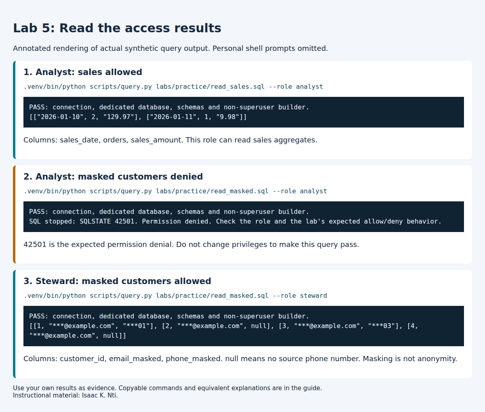

# Lab 5: Access control and masking

**Outcomes:** SLO 5. **Estimated time:** 60–90 minutes; allow additional time for installation and support.
**Environment:** your dedicated local course database. Synthetic data only.


## At a glance

| Before starting | Labs 1–4 |
| --- | --- |
| You will run | Run the supplied authenticated access checks. |
| You will write | Three access explanations, a proposed view and a short remote-server discussion in one private document. |
| Done when | Observed results and proposed controls are clearly distinguished. |
| Safe stopping point | After a completed section; save your draft before closing the editor. |
| Submission format | One private Lab 5 document using the headings in Submit; no shared template is needed. |

Follow the steps below in order. Keep configuration, generated logs and submissions private.
Return to the [required course path](../../../docs/course_checklist.md) when this lab is complete.

## Why this lab matters

The same database can expose different information to different people. You will test access using two actual logins and explain why a denied query can be the correct result.

## Learning objectives

These instructor-developed objectives support the outcomes listed above. You will:

- Distinguish authentication from authorization using observed query results.
- Explain what the analyst and steward can read, and what masking still reveals.
- Propose a smaller data view for a stated business purpose.

## Skills you will practice

Predict access, run supplied read-only SQL, interpret SQLSTATE 42501, and justify data minimization.

## What you will produce

- A1 technical evidence from the supplied access checks.
- Three A2–A4 prediction/result explanations tied to grants and view projections.
- One short authorization-error comparison.
- One proposed weekly-sales view and one short remote-server discussion.
- One evidence limitation stating what the tested cases do not establish.

Keep these in one private Lab 5 document; do not write a second essay.

## Concept

Authentication establishes the login. Authorization determines which operations it
can perform. The lab opens separate connections for the analyst and steward; successful
builder queries are not proof that those reader identities have the same access.

The builder owns the raw data and controlled views. Readers receive schema usage and
SELECT on specified views, but no raw schema access or membership in the builder role.
The analyst sees sales aggregates; the steward can additionally use masked customer
fields. A 42501 response confirms an authorization denial. A wrong-password error or
missing-table error would not establish the intended access boundary.

The views use their owner’s access to expose a deliberately restricted projection.
Granting access to an owner-controlled view therefore requires reviewing its entire
query. Adding a raw column later could expose it to every existing reader of that view.
The owner is trusted; the design does not protect raw data from its own owner.

Masking is data minimization, not proof of anonymity. Domains, suffixes, identifiers
and joinable patterns can still reveal information. Unkeyed hashes of predictable
identifiers are not a safe substitute for an access policy.

**Check your understanding:** Predict the three queries in Part A before
running them. Explain both the role grant and the view projection behind each result.

> **Completion:** Automation passing means the environment checks worked. Complete
> the independent investigation, interpretation and evidence below before submitting.

## Before you begin

Complete [Lab 4](../lab04-lineage-lifecycle/README.md) first for lineage context;
[Lab 2](../lab02-classification/README.md) introduces the source fields.
Run each command separately from the repository root in Ubuntu. Keep the same
configured environment; do not repeat setup. If you need an environment, use
[Student start here](../../../STUDENT_START_HERE.md). No prior SQL qualification
is assumed. Copy commands from code blocks; write explanations in your private
submission, not in the terminal.

Create one private document titled **Lab 5: Access control and masking** in your
text editor or word processor. Use the headings listed in **Submit** below.
Write notes there as you work; no separate general submission template is needed.

## Part A: Follow the supplied access checks

### A1. Build and check the access rules

```bash
.venv/bin/python scripts/course.py lab 5
```

Expected with the supplied data:

```text
PASS: connection, dedicated database, schemas and non-superuser builder.
PASS: synthetic seed present (existing data preserved).
PASS: nine access checks using separate authenticated connections, including escalation denials.
LAB 5 TECHNICAL CHECKS COMPLETE. Return to labs/core/lab05-access-control/README.md for interpretation and deliverables.
```

This configures the teaching views and grants, then checks nine outcomes. It does
not complete your explanation. Rerunning preserves existing raw/governance data.
The nine checks comprise five view-access checks and four raw-data/escalation
checks. A2–A4 are three representative outcomes for you to observe and explain;
you do not need to recreate the other checks manually.

### Before A2–A4: record three expectations

In your private document, create the headings **A2: Analyst sales**, **A3: Analyst
masked customers**, and **A4: Steward masked customers**. Under each, write
**Prediction: Allowed** or **Prediction: Denied** before running that command.
Use the Concept section to reason about the grants. Keep your original predictions;
if you already ran a query, write that no advance prediction was recorded and
label your explanation as a later interpretation.

**Why each output mentions the builder:** the helper first checks the environment
using the builder. It then executes the SQL through a separate authenticated
connection using the identity selected by `--role`. The initial builder PASS does
not mean that the reader query ran as the builder.

### A2. Read sales as the analyst

After recording your predictions, run:

```bash
.venv/bin/python scripts/query.py labs/practice/read_sales.sql --role analyst
```

After the connection PASS line, expect these rows (whitespace may differ):

```json
[["2026-01-10", 2, "129.97"], ["2026-01-11", 1, "9.98"]]
```

The positions mean **sales_date, orders, sales_amount**. Quoted decimal amounts
are JSON representations of exact database decimals. This analyst view has three
columns; it is not the five-column Lab 3 mart. Record that the analyst can read
these aggregates. If your source fixture differs, explain the resulting values.

### A3. Try masked customer data as the analyst

```bash
.venv/bin/python scripts/query.py labs/practice/read_masked.sql --role analyst
```

Expected after the connection PASS line:

```text
SQL stopped: SQLSTATE 42501. Permission denied. Check the role and the lab's expected allow/deny behavior.
```

**Record this as “Denied as expected” for this query and role.**
Do not change grants to make the query succeed. This observation demonstrates
the tested boundary, not that the entire database is secure. The command exits unsuccessfully;
continue to A4 only if the code is **42501**. The initial connection PASS checks
the builder configuration; it does not grant the analyst access to this view.
A missing table or wrong password is a different error and needs investigation.

### A4. Read the same view as the steward

```bash
.venv/bin/python scripts/query.py labs/practice/read_masked.sql --role steward
```

After the connection PASS line, expect:

```json
[[1, "***@example.com", "***01"], [2, "***@example.com", null],
 [3, "***@example.com", "***03"], [4, "***@example.com", null]]
```

Positions mean **customer_id, email_masked, phone_masked**. `null` means the source
phone number is missing; it is not an error. The domain, suffix and customer ID
remain visible. These synthetic values illustrate partial masking, not anonymity.

**Write under A4:** identify one thing hidden and one thing still revealed,
including what a missing phone value tells you. This is the masking response
requested in B1; write it once.



This visual renders the observed results without personal terminal details.
Copy commands from the text above; use your own results as submission evidence.

## Part B: Explain and propose a different access decision

No new SQL file or database edits are required. Add your answers to the same
private document. One to three sentences per explanation are normally enough.

### B1. Explain your three observations

Read the supplied [view definitions](02_build_safe_objects.sql) and
[grants](03_rbac_and_grants.sql). Inspect the relevant `CREATE ... VIEW`,
`GRANT USAGE` and `GRANT SELECT` statements; you do not need to understand every
line. A **projection** is the set of columns or expressions a view exposes.

Under each A2–A4 heading, complete these labels. A table is optional; labeled
paragraphs are sufficient and easier to edit in a terminal.

- **Command and role:** the command you ran and the selected reader identity.
- **Prediction:** preserve the expectation recorded earlier, or your timing note.
- **Actual result:** the relevant returned rows or the exact denial message.
- **Permission explanation:** name the requested view, whether the supplied
  grants permit this role to read it, and the SQL file supporting your explanation.
- **Projection explanation:** for an allowed query, explain what the view exposes
  or hides, using its definition. For the denied query, state that no customer
  rows were returned; do not claim to have observed masked values through it.
- **Comparison:** state whether the result matched your recorded prediction, if any.

Keep your A4 masking observation here; do not repeat it elsewhere.

### B2. Distinguish authorization evidence from another error

Under **Authorization evidence**, explain why A3's `42501` supports a denial claim
for the tested query and role. Name one different error, such as a wrong-password,
missing-object or syntax error, and explain why it would not demonstrate the same
boundary. Do not deliberately cause that error; this is a short written comparison.

### B3. Propose a weekly-sales view

Under **Proposed weekly-sales view**, answer these prompts for a fictional manager
who needs weekly sales trends. A short sentence or list for each is enough.

- **Purpose:** what business question should the manager answer?
- **Grain:** what should one row represent?
- **Fields included:** which sales fields are necessary for that purpose?
- **Fields omitted:** which customer-level fields should be excluded, and why?
- **Remaining risk:** what could still be inferred or exposed?
- **Status:** label your design **Proposed**; you are not implementing or testing it.

### B4. Discuss a shared remote server

Under **Remote-server discussion**, propose one protection for the connection
and one change to identity, credential or access management. Explain their
different purposes in two or three sentences. Verified encrypted transport and
managed individual credentials are examples of protections addressing different
problems. No installation or optional TLS experiment is required.

### B5. State one evidence limitation

Under **Evidence limitation**, write one or two sentences naming something your
A1–A4 execution does **not** establish. Distinguish the access cases you actually
tested from a broader claim about every database object, every future configuration
or the security of the entire system.

Do not simply repeat B3's remaining privacy risk unless it genuinely answers this
evidence question. A privacy risk and an evidence limitation can be related, but
they are not automatically the same claim.

**Part B complete:** your document explains the three observations, distinguishes
an authorization denial from another error, contains the proposed view and
remote-server discussion, and states one evidence limitation. The proposals are
written work, not executed controls.

## Submit

Optional: use the [local report checker](../../../docs/report_checker.md) after
writing your submission. Replace the path below with your actual private report
filename. Warnings are suggestions, not grades or new submission requirements.

```bash
.venv/bin/python scripts/report_checks/lab05.py .local/lab5-report.md
```

See the optional Lab 5 [sample submission](Lab5_Sample_Submission_README.md)
for selected actual walkthrough results and examples of the expected detail.
Use your own evidence and reasoning. The sample is not an additional assignment.

Submit one private document with these headings:

1. **A1: Technical evidence:** command and relevant PASS lines.
2. **A2: Analyst sales**, **A3: Analyst masked customers**, and **A4: Steward
   masked customers:** the labeled responses from B1, including A4's masking observation.
3. **Authorization evidence:** the B2 error comparison.
4. **Proposed weekly-sales view:** the six brief B3 responses.
5. **Remote-server discussion:** your B4 response.
6. **Evidence limitation:** one conclusion your execution does not establish.
7. **Recovery and assistance:** describe recovery only if an unexpected error
   occurred; the expected A3 denial is not a fault to repair. State any AI
   assistance and how you checked it, or `None`, following course rules.

No separate general template, repeated essay or screenshot is required. Do not
submit `.env`, credentials, full logs or personal terminal prompts. Submit through
the LMS using the instructor's file-format requirements, or retain privately for
self-study. Do not publish the completed document in this repository.

Rubric: correct execution/evidence 25%; accurate interpretation 35%; transfer and
tradeoff reasoning 30%; clarity and evidence limitations 10%.

## Recovery

Use the [setup troubleshooting table](../../../docs/setup.md). Read errors before retrying;
never delete tests or change authentication to make a result pass. There is no
automatic destructive reset. For an isolated new start use a new DB/user pair.

[Back to all labs](../../README.md)

---

Author: [Isaac K. Nti](../../../AUTHORS.md). [Citation and reuse terms](../../../CITATION.md).
