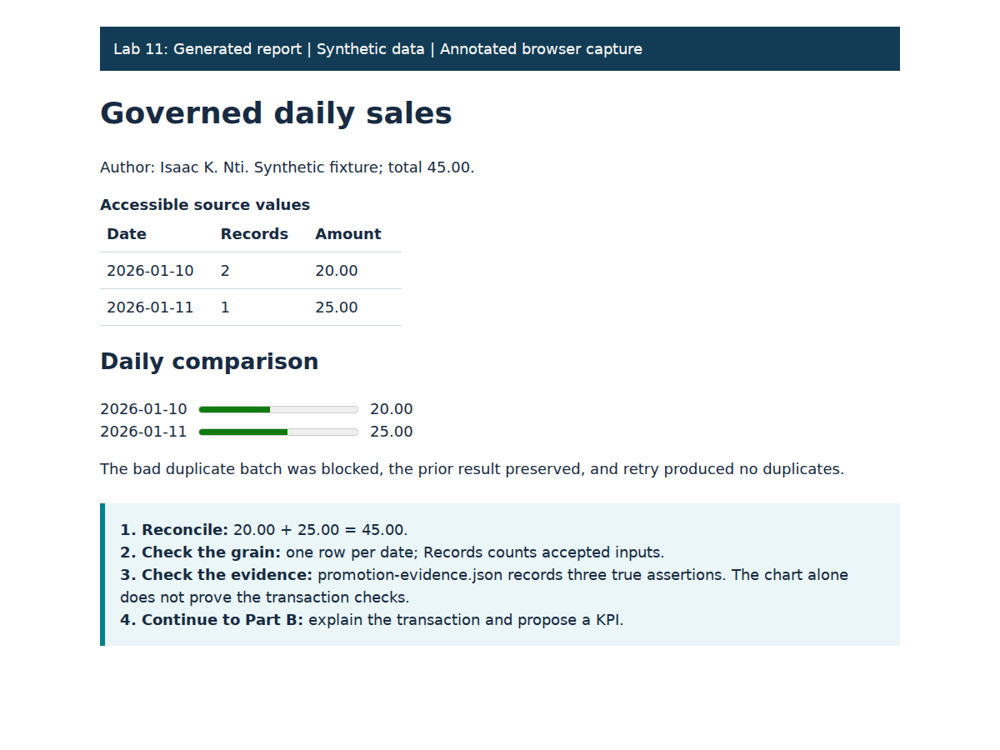

# Optional Lab 11: Quality-gated publication and a reconciled KPI

> **Completion:** Passing automated checks, where present, confirms technical behavior.
> Complete the independent task, explanation and evidence specified on this page.

**Author:** Isaac K. Nti. **Outcomes:** SLOs 2, 4; supports advanced governance.
**Time:** 60–90 minutes. Optional enrichment.

## Why this lab matters

A failed batch must not replace a trustworthy report. You will observe rejection, preservation and retry, then specify a second reporting measure.

## Learning objectives

These instructor-developed objectives support the outcomes above. You will:

- Verify a rejected batch preserves the last valid publication.
- Reconcile daily values and explain an idempotent retry.
- Describe keys, grain and a second KPI contract.

## Skills you will practice

Inspect transaction evidence, read a local report, draw a simple data model and justify a metric.

## Purpose and prerequisites

Complete [Lab 3](../module_2/lab3/README.md) and [optional Lab 10](catalog_ingestion.md). Use the same Ubuntu environment and run commands from the repository root. A reporting pipeline must preserve its last
good publication when a new batch fails. The experiment uses the dedicated course
database and the same private configuration; no new account is needed.

Vocabulary: staging, quality gate, transaction, rollback, idempotency, KPI grain.

## Part A: Follow publication and retry

1. Predict the two daily totals and the number of approved records from Lab 10.
   Predict what a duplicated identifier would do to an unguarded revenue total.
2. Run:

   ```bash
   .venv/bin/python scripts/optional_labs.py promotion
   ```

3. The runner publishes the valid batch, attempts an intentionally duplicated batch,
   asserts that publication is blocked and the previous result preserved, then
   retries the valid batch and asserts that it has not created duplicates.
4. Expect the catalog PASS lines from Lab 10, then:

   ```text
   PASS: duplicate batch blocked; prior publication preserved; retry idempotent; KPI total 45.00.
   Open .local/optional-kpi.html and interpret .local/promotion-evidence.json.
   ```

   Read the evidence:

   ```bash
   .venv/bin/python -m json.tool .local/promotion-evidence.json
   ```

   Expect `invalid_batch_blocked`, `previous_publication_preserved` and
   `retry_idempotent` all `true`. In `daily_sales`, the positions are **date,
   accepted record count, amount**: January 10 has count 2 and January 11 count 1.

   Open the repository's `.local` folder in your file manager, then open
   `optional-kpi.html` in a browser. In WSL, `explorer.exe .local` opens that folder
   in Windows Explorer when Windows integration is enabled. No web server is needed.
   If browser access is unavailable, the JSON values provide equivalent evidence.
   The accessible table and visual comparison must reconcile to **45.00**:
   20.00 on January 10 and 25.00 on January 11, 2026.
5. Repeat the command. Expect the same publication and the same negative-control result.

## Part B: Explain the transaction and design a KPI

Inspect `publish` in `scripts/optional_labs.py`. Identify the transaction boundary,
staging table, quality checks, publication statements and rollback path. Explain
why moving deletion outside the transaction could destroy the last good result.

Draw an editable ERD (entity relationship diagram) for incoming records and the
published daily summary, labeling keys and what one row represents. A two-box
text diagram in your private Markdown submission is sufficient: list the incoming
fields, list the daily-summary fields, and label the many-records-to-one-day
relationship. A shared date does not automatically establish an enforced foreign key.
No modeling application or new database table is required.

Design a second KPI and state its denominator, exclusions and
reconciliation rule. Explain which additional checks would be needed for currency,
late arrivals, duplicate batches with changed values and legitimate refunds.



The visual is a browser capture of the generated teaching report with an explanatory
caption. The text and JSON above provide the same totals. Submit your own evidence.

## Evidence and assessment

Submit an ERD source file, predicted/observed totals, the blocked-publication evidence,
a short failure/recovery explanation and your proposed KPI contract. Suggested rubric:
correct evidence 25%, transaction/quality reasoning 35%, model/KPI transfer 30%,
limitations 10%. The report is evidence for this miniature pipeline, not automatic
proof that a different capstone architecture has been implemented.

## Recovery and limits

This runner replaces only `<configured schema>.optional_daily_sales`, a derived table
reserved for this optional fixture, and its own `.local` reports. Do not store your
independent data in that table. Core raw, dbt and governance-register data are preserved.
Rerun with the original fixture after investigating an error; do not remove quality gates.

This is a synchronous local batch with PostgreSQL transaction guarantees. It does not
deploy Airflow, schedule jobs, replicate data or prove regulatory compliance.

[All labs](../README.md) · [Attribution](../../CITATION.md)

---

Author: [Isaac K. Nti](../../AUTHORS.md). [Citation and reuse terms](../../CITATION.md).
