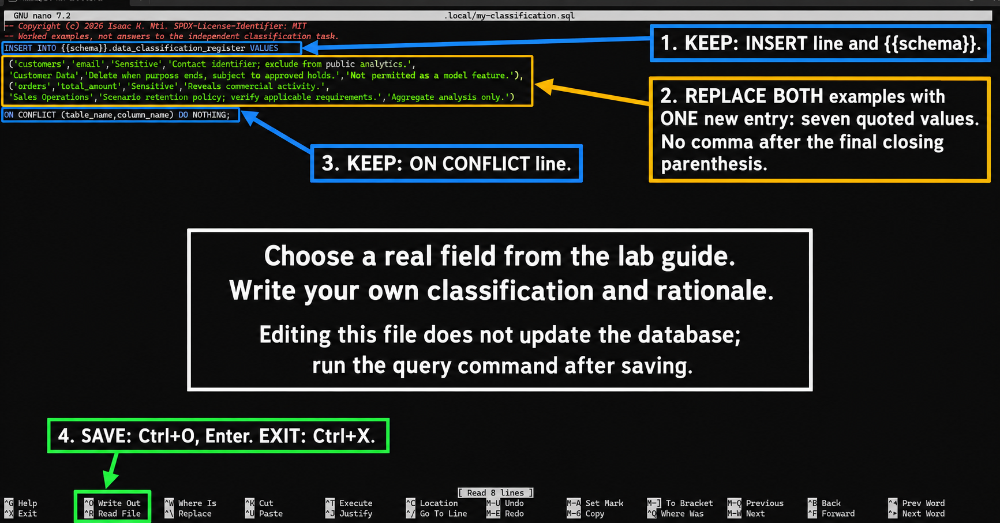

# Lab 2: Classification and stewardship

**Outcomes:** SLOs 1,5. **Estimated time:** 45–60 minutes; allow additional time for installation and support.
**Environment:** your dedicated local course database. Synthetic data only.

## Why this lab matters

A data administrator needs to explain who owns a field, why it is used, how
sensitive it is and what restrictions apply. A governance register makes those
decisions visible for review. In this lab, you record decisions for synthetic
retail data and distinguish documented policy from an enforced database control.

## Learning objectives

These instructor-developed lab objectives support the course outcomes above.
By the end of this lab, you should be able to:

- Classify a field using its purpose, sensitivity and potential harm.
- Insert and inspect a governance-register entry using a provided SQL pattern.
- Justify ownership, retention assumptions and permitted AI use.
- Explain why recording a policy does not enforce it.

## Skills you will practice

Read a simple SQL INSERT, edit a private SQL file in Nano, execute it with the
course query helper, interpret JSON results and verify that an entry survives a rerun.
No prior INSERT-writing experience is assumed; complete the guided example first.

## What you will produce

A guided example observation, two independent written field classifications,
one original register entry with before/after evidence, and a short explanation
of your decisions and their limits. Use the submission checklist at the end.

## Concept

Classification connects a data field to an intended use, accountable owner and
control. A label alone does not restrict a query. The register records your reasoning;
Lab 5 implements selected controls through database grants and views.

Use the field’s meaning, context and plausible harm to justify its class. A customer
email is a contact identifier even if its SQL type is merely text. Aggregation can
reduce exposure but small groups and joins may reveal information. Classification
can change when data is combined or repurposed for AI.

Worked entries demonstrate the format, not an organization-wide policy. Retention
periods must come from an approved purpose and applicable requirements; do not invent
a universal legal retention duration. Record unresolved assumptions explicitly.

**Check your understanding:** Two teams classify an amount differently. What business
context would resolve the disagreement? What evidence would show that their chosen
control actually operates? Add a field with your own rationale using the investigation below.

> **Completion:** Automation passing means the environment checks worked. Complete
> the independent investigation, interpretation and evidence below before submitting.

## Before you begin

Complete [setup](../../docs/setup.md) and Lab 1. No university service or hidden download is needed.
The runner checks its required state and reports missing prerequisites.

## Predict and run

Read the expected result below and predict what would fail with the wrong identity or missing input.
From the repository root in your Ubuntu terminal:

```bash
.venv/bin/python scripts/course.py lab 2
```

### Expected terminal output

A successful run prints these summary checks:

```text
PASS: connection, dedicated database, schemas and non-superuser builder.
PASS: synthetic seed present (existing data preserved).
PASS: governance register. Add your own rationale in the submission template.
```

A completion message follows. Older checkouts may show a garbled separator after
`LAB 2 COMPLETE`; that does not change the check results. Use the three PASS lines
as evidence, not the exact punctuation of the completion message.

| Check | What it establishes | What you still need to investigate |
| --- | --- | --- |
| Connection and builder | The same environment checks used in Lab 1 pass. | This is not a new test of all analyst/steward permissions. |
| Synthetic seed | The runner creates the four source tables on first use and checks the expected table presence and that customers are present. Existing data are preserved. | This is not a complete data-quality check; later modeling tests examine additional rules. |
| Governance register | The register setup and worked-example inserts succeed, and the register contains at least two entries. | The runner does not grade your rationale, validate every classification, or enforce retention and AI-use rules. |

On a fresh course database there are two worked register entries: `customers.email`
and `orders.total_amount`. Reruns can show more entries because your additions are
preserved. **The lab command does not print the table contents or register rows.**
Use the inspection command below to see those rows. No extra installation is needed.

## Hands-on investigation

1. Inspect the register from the repository root:

   ```bash
   .venv/bin/python scripts/query.py labs/practice/inspect_register.sql
   ```

   This prints register rows as JSON, including classification, rationale, owner,
   retention rule and AI use. Read the two worked examples before choosing new fields.
### Guided example: insert a complete entry

Assume the retailer needs account-age reporting for internal account administration.
For this example, the steward proposes Internal classification for `customers.created_at`
and limits AI use to aggregate reporting. These are scenario decisions, not a
universal policy or a legal retention rule. Another context could justify a different
classification. Review the assumptions rather than treating the example as an answer key.

Create a separate private example file so you do not overwrite your independent work:

```bash
nano .local/worked-classification.sql
```

If the file is new, Nano opens a blank editing area. Paste the complete SQL below.
If you previously saved different work under this filename, preserve it and choose
another private filename instead. Run SQL through `scripts/query.py`, not directly
at the shell prompt: the helper replaces `{{schema}}` with your configured schema.

```sql
INSERT INTO {{schema}}.data_classification_register
    (table_name, column_name, classification, rationale,
     owner_role, retention_rule, ai_use)
VALUES (
    'customers',
    'created_at',
    'Internal',
    'Supports account-age reporting; linked timestamps can reveal customer activity.',
    'Customer Data Steward',
    'Retain while needed for account administration; review before deletion and honor approved holds.',
    'Aggregate account-age reporting only; individual profiling requires a separate purpose review.'
)
ON CONFLICT (table_name, column_name) DO NOTHING;
```

The column names above `VALUES` tell PostgreSQL where each value belongs. Match
values to columns in the same order:

| Column | Example value and meaning |
| --- | --- |
| `table_name` | `customers`: the source table described by the register entry |
| `column_name` | `created_at`: the source field being classified |
| `classification` | `Internal`: the sensitivity decision under this scenario |
| `rationale` | Why account-age reporting needs the field and what exposure could reveal |
| `owner_role` | The fictional role responsible for reviewing the decision |
| `retention_rule` | A proposed purpose-based rule requiring review, not a legal duration |
| `ai_use` | A limited use and a condition for considering a different purpose |

This INSERT adds metadata to the register. It does not add a customer, change the
customer timestamp, delete expired data or enforce the stated AI-use restriction.
`ON CONFLICT` skips a table/column pair that already exists; it does not update it.

Save with **Ctrl+O**, press **Enter** to confirm the filename, then **Ctrl+X** to
return to the shell. Before running, predict how many entries you will see.

```bash
.venv/bin/python scripts/query.py .local/worked-classification.sql
.venv/bin/python scripts/query.py labs/practice/inspect_register.sql
```

The INSERT may print no result rows. The inspection command should include the
following JSON row inside its outer list, alongside the original examples:

```json
[
  "customers",
  "created_at",
  "Internal",
  "Supports account-age reporting; linked timestamps can reveal customer activity.",
  "Customer Data Steward",
  "Retain while needed for account administration; review before deletion and honor approved holds.",
  "Aggregate account-age reporting only; individual profiling requires a separate purpose review."
]
```

Expect **three entries** if you started with only the two baseline examples.
Rows are sorted by table and column, so your new row need not appear last. If the
pair already existed, its earlier values remain; inspect and explain that result
rather than deleting it to match the example. Record the actual row and explain
why this command records a governance decision without enforcing it.

### Independent practice: make your own decision

The guided `customers.created_at` entry is practice, not your independent answer.
Use different fields below. Keep the worked file separate from your own draft.

1. Choose one additional customer field and one additional order field. In
   `labs/module_2/lab2_seed.sql`, the names immediately after `CREATE TABLE
   raw.customers (` and `CREATE TABLE raw.orders (` define the available columns.
   Choose from these fields (the two baseline examples and guided example are excluded):

   | Table | Available fields for your task |
   | --- | --- |
   | `customers` | `customer_id`, `first_name`, `last_name`, `phone_number` |
   | `orders` | `order_id`, `customer_id`, `order_date`, `order_status`, `payment_method` |

   Classify both in writing. Select one of them to insert below. You choose and
   justify the classification; there is no single classification supplied for you.
2. Create and edit a private draft. Run the copy command only the first time; copying
   again would overwrite your draft. To resume work, use only the `nano` command.

   ```bash
   cp labs/module_2/lab2_insert_templates.sql .local/my-classification.sql
   nano .local/my-classification.sql
   ```

   **Inside Nano:** keep the comments, `INSERT INTO ... VALUES` line and final
   `ON CONFLICT ... DO NOTHING;` line. Replace BOTH example entries with ONE entry
   of your own. Use the arrow keys to move to the first example line. `Ctrl+K`
   removes the current line; remove the four example-value lines, stopping before
   `ON CONFLICT`. Type or paste your new entry between `VALUES` and `ON CONFLICT`.
   Your editor may wrap long lines; check that both original examples are gone.

   

   The image is an annotated editing aid. Follow the text and SQL structure below;
   do not transcribe small screenshot text. The same steps are provided in text.

   **Seven values, in order:**

   | Position | Value | What to enter |
   | --- | --- | --- |
   | 1 | Table | `customers` or `orders`, without `raw.` |
   | 2 | Column | An actual field from that table's list above |
   | 3 | Classification | Exactly `Public`, `Internal`, `Sensitive` or `Restricted`; justify your choice |
   | 4 | Rationale | Your intended purpose, plausible harm and reason for the classification |
   | 5 | Owner role | A fictional business role accountable for the data, not your name |
   | 6 | Retention rule | A purpose-based proposal, with assumptions or unresolved requirements stated |
   | 7 | AI use | An allowed use or restriction consistent with your purpose and rationale |

   **Editing skeleton, not a completed answer:** replace EVERY `REPLACE_...` value
   before running. The classification placeholder is deliberately not an allowed
   classification. Keep `{{schema}}` exactly as written; the runner supplies it.

   ```sql
   INSERT INTO {{schema}}.data_classification_register
       (table_name, column_name, classification, rationale,
        owner_role, retention_rule, ai_use)
   VALUES (
     'REPLACE_TABLE',
     'REPLACE_COLUMN',
     'REPLACE_CLASSIFICATION',
     'REPLACE_RATIONALE',
     'REPLACE_OWNER_ROLE',
     'REPLACE_RETENTION_RULE',
     'REPLACE_AI_USE'
   )
   ON CONFLICT (table_name,column_name) DO NOTHING;
   ```

   Keep single quotes around each value and commas between values. There is no
   comma after the seventh value or after `)`. If your text contains an apostrophe,
   double it inside the SQL string: `customer''s`. Use straight quotes, not curly
   word-processor quotes. The register does not automatically check that a field
   name exists in the source; verify it against the list above yourself.

   **Save and exit:** press `Ctrl+O` (letter O), then `Enter` to confirm the filename,
   then `Ctrl+X`. Nano's `^` notation means Ctrl. You should return to the shell
   prompt. Saving edits a file; it does not update the database.

   Run these commands at the shell prompt, not inside Nano:

   ```bash
   .venv/bin/python scripts/query.py .local/my-classification.sql
   .venv/bin/python scripts/query.py labs/practice/inspect_register.sql
   ```

   The first command executes your INSERT; it need not print the new row. The
   second displays register rows as JSON arrays in the seven-value order above.
   Expect **four entries** after the two baseline examples, guided example and
   your one new independent entry. If you already added other fields, expect those too. Find your table/column pair and
   check that all seven values match your draft.

3. Test preservation by rerunning the baseline and inspecting again:

   ```bash
   .venv/bin/python scripts/course.py lab 2
   .venv/bin/python scripts/query.py labs/practice/inspect_register.sql
   ```

   Confirm your selected row and its rationale remain. This repeat has a specific
   purpose: testing preservation after your edit. Do not claim preservation from
   the baseline PASS message alone; compare the observed row before and after.

For custom SQL, use the [query helper instructions](../practice/README.md#execute-your-own-sql-without-managing-passwords).

## Interpret and transfer

Use the two fields you selected above; no third field is required. Defend one
plausible alternative classification and explain which business context would change
your decision. Compare with a peer if available; independent learners can write the
alternative perspective themselves. Explain why a register label alone does not
prevent an unauthorized query.

## Submit

Create a private Lab 2 submission using the [shared template](../../submissions/template.md).
Leave the repository template unchanged. Include:

1. **Command and baseline evidence:** `.venv/bin/python scripts/course.py lab 2`
   and the three PASS lines from your own run. Do not submit your full terminal
   history, personal shell prompt or private configuration.
2. **Prediction:** your recorded expectation before the baseline run. If you already
   ran it without recording one, say so honestly; do not invent a prior prediction.
   Before the preservation experiment, predict whether your new row will survive.
3. **Observed register evidence:** include the guided example row you actually
   observed and explain whether it was inserted or already present. Then include
   the inspection command and JSON excerpt for your independent field before and
   after rerunning Lab 2. Describe the comparison.
4. **Your classifications:** the two independent written field classifications (not
   the guided example) and your edited
   INSERT statement for one of them. This reasoning is your work, not runner output.
5. **Interpretation and transfer:** the alternative classification and the distinction
   between recording a policy and enforcing it. State one limitation of these checks.
6. **Assistance disclosure:** complete the common template's assistance section.

Readable text evidence is sufficient; screenshots are optional. Submit privately
through the course system, or retain the work locally for independent study.
A successful baseline run alone does not complete this lab.

Rubric: correct execution/evidence 25%; accurate interpretation 35%; transfer and
tradeoff reasoning 30%; clarity and evidence limitations 10%.

## Recovery

| Symptom | Safe next action |
| --- | --- |
| Still inside Nano | Save with Ctrl+O, Enter, then exit with Ctrl+X before running shell commands. |
| Syntax error (`42601`) | Reopen your private draft. Check quotes, seven comma-separated values, balanced parentheses and no comma before ON CONFLICT. |
| Check constraint failure (`23514`) | Replace the classification placeholder with one of the four exact allowed labels. |
| No new entry after a successful INSERT | Check whether your table/column pair already exists. ON CONFLICT skips it; repeated INSERTs do not update an existing entry. |
| Need to revise an existing entry | Preserve the current row and ask your instructor about a targeted UPDATE. Do not delete the register or change the baseline examples. |
| Row appears under a misspelled field | The register stores your text; it does not validate source field names. Identify the mistake and arrange a targeted correction with your instructor. |

Use the [setup troubleshooting table](../../docs/setup.md). Read errors before retrying;
never delete tests or change authentication to make a result pass. There is no
automatic destructive reset. For an isolated new start use a new DB/user pair.

[Back to all labs](../../labs/README.md)

---

Author: [Isaac K. Nti](../../AUTHORS.md). [Citation and reuse terms](../../CITATION.md).
