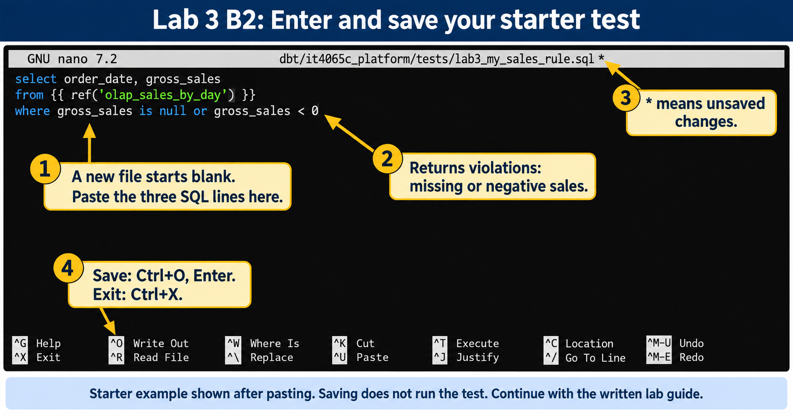

# Lab 3: Modeling and data quality

**Outcomes:** SLO 4. **Estimated time:** 60–90 minutes; allow additional time for installation and support.
**Environment:** your dedicated local course database. Synthetic data only.

## Why this lab matters

A report can run successfully and still give the wrong answer. Joining orders to
their items can count the same order total repeatedly, while including cancelled
orders can change reported revenue. Data administrators need to trace a reported
number to its sources and test the assumptions behind it.

This lab builds the supplied retail models, checks their data and asks you to
explain the completed-order revenue before designing a test of your own.

## Learning objectives

These instructor-developed lab objectives support SLO 4. By the end of the lab,
you should be able to:

- Follow a worked example from order items to daily sales totals.
- Identify what one daily sales row represents and explain how a join
  can repeat order-level values.
- Reconcile completed-order revenue with source records and explain the treatment
  of cancelled orders.
- Write and run a dbt SQL data test, explain which rows would violate its rule,
  and distinguish passing tests from proof that all data is correct.

## Skills you will practice

Run a supplied dbt build through the course runner, read model SQL, inspect query
results, reason about joins and aggregation, and add a focused data-quality test.
You will also practice explaining the evidence behind a business metric.

No prior SQL or Python programming experience is assumed in this guide. The
[foundations bridge](../../../docs/foundations.md) provides extra practice whenever
you need it. The supplied models and worked examples are your starting point;
you do not need to build a complete pipeline from scratch.

## What you will produce

- Relevant baseline execution results and your interpretation.
- Three short A3 responses explaining repeated totals, the completed-order
  revenue of 139.95 and the cancellation rule for the supplied dataset.
- One original dbt SQL test, your prediction, its observed result after rerunning
  Lab 3, and an explanation of the rule it checks.
- One limitation of your test; the join-related explanation is already covered in A3.

The runner produces technical results. You write the reconciliation, test reasoning
and limitations in your private submission; follow Part C below.

## Concept

The pipeline separates raw source records, standardized staging views, core entities
and purpose-specific marts. In this teaching database, raw records are synthetic;
the core models are derived copies, not automatically an authoritative system of record.

State the grain before writing a join. An order has several items. Joining its total
to each item repeats that total, which can distort sums and averages. The sales mart
first aggregates items to one row per order, then aggregates completed orders by day.
Its cancelled-order policy is a business assumption that must be documented.

A dbt data test returns rows violating an expectation. Uniqueness, missing values,
relationships and amount reconciliation are different claims. A passing test does
not prove the entire dataset is correct. Tests run when invoked; they are not database
constraints that prevent every future invalid write. This fixture deliberately leaves
some relationships to dbt tests so learners can observe the distinction.

The detailed and aggregate marts illustrate workload differences. They do not establish
transaction throughput, dimensional completeness or production performance. A
passing local build provides no measurements of those production properties.

**Check your understanding:** complete the three short responses in A3. They cover
repeated order totals, daily sales and the completed-order rule; no separate response
is required here.

> **Completion:** Automation passing means the selected technical checks passed. Complete
> the independent investigation, interpretation and evidence below before submitting.

## Before you begin

We strongly recommend completing these earlier labs before starting Lab 3:

- [Lab 1: Environment readiness](../../module1_preflight/README.md): understand
  configuration, database identities and the limits of a successful connection check.
  Setup runs its technical checks automatically; its investigation and written work
  are separate learning activities.
- [Lab 2: Classification and stewardship](../M2_lab2_governance.md): become familiar
  with the synthetic retail data, query helper and governance decisions used here.

Use the same working environment and repository checkout from those labs. **Do not
repeat setup or Lab 1's technical checks just to start Lab 3.** A configured local
environment is required; if you are joining here without one, follow
[Student start here](../../../STUDENT_START_HERE.md) first. The runner checks its
required technical state, but it does not assess completion of earlier written work.

## Lab route

| Part | Your task | Completion checkpoint |
| --- | --- | --- |
| A: Guided baseline | Build the supplied models, inspect the sales output and trace its meaning | Ten models and 37 tests on an unchanged checkout; two daily sales rows totaling 139.95 |
| B: Test-writing practice and independent application | Run a complete example test, then write a different rule in your own file | Your named test appears in dbt results and you explain its rule, result and limits |
| C: Submission | Separate observed results from your own reasoning | A private, labeled evidence-and-reasoning submission |

Run commands one at a time from the repository root. Do not repeat setup. Additional
tests from previous practice can increase the count; do not delete them just to match
this guide. Stop on errors and use Recovery rather than treating a later PASS as a fix.

## Part A: Guided baseline and annotated results

### A1. Build the supplied project

Before running, record what you expect a successful build to establish and one thing
it cannot establish. If you already ran it, say so rather than inventing a prediction.

```bash
.venv/bin/python scripts/course.py lab 3
```

Expected on the unchanged supplied project:

```text
PASS: connection, dedicated database, schemas and non-superuser builder.
PASS: synthetic seed present (existing data preserved).
PASS: dbt build --selector course
PASS: 10 models and 37 data tests actually executed.
LAB 3 COMPLETE: technical checks passed; review interpretation and deliverables in labs/README.md.
```

The build creates the models and executes tests. The model/test count is verified
from dbt artifacts, not merely a printed target. Passing proves only the selected
checks for this execution. It does not complete the written task or prove production
readiness. Retain the relevant PASS lines privately.

### A2. Inspect daily sales

```bash
.venv/bin/python scripts/query.py labs/practice/inspect_sales.sql
```

After the environment PASS line, expect:

```json
[
  ["2026-01-10", 2, "3", "129.97", "64.9850000000000000"],
  ["2026-01-11", 1, "2", "9.98", "9.9800000000000000"]
]
```

Whitespace may differ. The helper serializes some PostgreSQL numeric values as
quoted text; this display does not mean the database columns store currency as text.
Do not paste this JSON into SQL. Each inner list is one day, with these annotations:

| Position | Model column | Meaning | January 10 | January 11 |
| --- | --- | --- | --- | --- |
| 1 | `order_date` | Day of completed orders | 2026-01-10 | 2026-01-11 |
| 2 | `orders_count` | Number of completed orders | 2 | 1 |
| 3 | `items_sold` | Sum of quantities, not count of order-item rows | 3 | 2 |
| 4 | `gross_sales` | Sum of completed orders' item amounts | 129.97 | 9.98 |
| 5 | `avg_order_value` | Average completed-order total for that day | 64.985 | 9.98 |

**What to notice:** daily revenue sums to **139.95**. January 10's average is
129.97 / 2 = 64.985; its long decimal display is normal. January 11 has one order
containing two units, so units sold and order count differ. The date-level rows
are already aggregated; they are not individual orders.

### A3. Explain the results in three short responses

**Your task:** follow the worked example below, then answer the three numbered
prompts. Write your answers under **Part A: Interpretation** in your private
submission using a text editor or word processor. Two or three sentences per
response, plus the requested calculation, are enough.

Everything needed is shown here. No SQL editing, new commands or screenshots are
required. The source links are available for exploration; opening every file is
not part of the task.

#### A3.1. Follow one order: why totals can be counted twice

Order 1 is a completed purchase on January 10. Its total is **79.98** and it
contains these two items. Matching an order to its items is called a **join**:

| Order | Item | Quantity | Item amount | Order total repeated by the join |
| --- | --- | --- | --- | --- |
| 1 | Wireless Mouse | 1 | 29.99 | 79.98 |
| 1 | Laptop Stand | 1 | 49.99 | 79.98 |

The item amounts add to **29.99 + 49.99 = 79.98**. Adding the repeated order totals
would give **159.96**, even though the customer placed only one order worth 79.98.
The daily sales model first combines the items into one row per order, then
combines orders into one row per day. What one row represents is called its **grain**.

**Response 1:** In your own words, why would adding the repeated order totals give
the wrong revenue? Finish with: “One row in the daily sales output represents …”

#### A3.2. Use the example to explain January 11

Here is the order-level information from the supplied synthetic dataset:

| Date | Order | Status | Units | Amount |
| --- | --- | --- | --- | --- |
| January 10 | 1 | Completed | 2 | 79.98 |
| January 10 | 2 | Completed | 1 | 49.99 |
| January 11 | 3 | Cancelled | 1 | 19.95 |
| January 11 | 4 | Completed | 2 | 9.98 |

**Worked example for January 10:** both orders are completed. Together they give
2 orders, 3 units and revenue of 79.98 + 49.99 = **129.97**, matching A2.

**Response 2:** Using the same approach, explain why your January 11 output shows
**1 order, 2 units and revenue of 9.98**. Say why order 3 is excluded, then show the
addition of the two daily revenues to obtain the overall completed-order revenue.
Use your A2 output; if it differs, record the difference and use Recovery.

#### A3.3. Connect the decision to one SQL line

The [daily sales model](../../../dbt/it4065c_platform/models/marts/lab3/olap_sales_by_day.sql)
contains this line. It is an excerpt to read, not a command to run:

```sql
where o.order_status='completed'
```

`where` keeps rows meeting a condition. Here, `o` is a short name for the order
source, and the condition keeps orders whose status is `completed`. An earlier
preparation step converts source text such as `Completed` to lowercase.

**Response 3:** What reporting rule does this line implement? If cancelled orders
were included instead, would the reported revenue increase, decrease or stay the
same for this dataset? Explain using order 3; no code change is needed.

**A3 completion check:** your submission contains just these three labeled answers:

```text
1. Repeated totals and what one daily row represents:
2. January 11 explanation and total revenue calculation:
3. Completed-order rule and the effect of including order 3:
```

These responses are the required A3 interpretation. You do not need a separate
file-by-file explanation, a daily-average comparison or an additional test.
Test-writing starts in Part B.

<details>
<summary>Optional: explore how the supplied files connect</summary>

The [synthetic records](../lab2_seed.sql) provide the source data.
[Order staging](../../../dbt/it4065c_platform/models/staging/lab3/stg_orders.sql)
standardizes fields such as status. The
[order model](../../../dbt/it4065c_platform/models/core/lab3/fct_orders.sql) and
[item model](../../../dbt/it4065c_platform/models/core/lab3/fct_order_items.sql)
feed the daily sales model. A model is a saved SQL query that produces a table or
view; `ref` names another model to read. The
[detailed order mart](../../../dbt/it4065c_platform/models/marts/lab3/oltp_order_detail.sql)
provides one row per order item, while the daily sales model provides one row per
day. A mart is a model prepared for a particular reporting use.

This reading is optional and requires no additional submission.

</details>

> **Part A complete:** retain the successful baseline output from A1, the daily
> rows from A2 and your three short responses from A3. For the unchanged fixture,
> daily revenue totals 139.95. Record and investigate differences before claiming
> that your baseline matches.

## Part B: Learn the test pattern, then write your own

A dbt SQL data test is a SELECT that returns **violations**. Zero returned rows
means pass; returned rows mean the rule failed. A syntax or connection error means
the test could not run, which is different from finding bad data. A passing rule
can still be incomplete or poorly designed, so your explanation matters.

### B1. Run a complete teaching example

The [guided test SQL](lab3_guided_test.sql) asks whether a daily sales row has a
missing or non-positive completed-order count. Its assumption is that each reported
day contains at least one completed order.

```sql
select order_date, orders_count
from {{ ref('olap_sales_by_day') }}
where orders_count is null or orders_count <= 0
```

`ref` tells dbt which model to use and records the dependency. Unlike Lab 2's
`{{schema}}` SQL, this test must run through dbt via the course runner, **not**
through `scripts/query.py`. Do not replace `ref` with a password, schema or table path.

Copy the complete example into the dbt test directory:

```bash
cp -i labs/module_2/lab3/lab3_guided_test.sql dbt/it4065c_platform/tests/lab3_guided_daily_orders.sql
```

**Expected after copying:** on the first successful copy, the terminal returns to
its prompt without printing a message. This is normal; copying does not run the test.
If prompted to overwrite existing work, answer `n` and inspect that file first.
If you see `cannot stat` or `No such file or directory`, stop: the copy failed.
Check that you are at the repository root and that the source path matches the
command exactly. If the supplied file is missing, ask your instructor for help;
do not continue after a failed copy.

Predict the test's result on the two observed daily rows, then run:

```bash
.venv/bin/python scripts/course.py lab 3
```

**Expected output with the original tests plus this one guided test:**

```text
PASS: connection, dedicated database, schemas and non-superuser builder.
PASS: synthetic seed present (existing data preserved).
PASS: dbt build --selector course
PASS: 10 models and 38 data tests actually executed.
LAB 3 COMPLETE: technical checks passed; review interpretation and deliverables in labs/README.md.
```

**How to read this result:**

- The connection check passed and the existing synthetic data was preserved.
- dbt built the selected project and its checks passed. The model count remains
  **10**; the test count increases from **37 to 38** because you added one SQL test.
- The guided rule passes because the observed daily order counts, 2 and 1, are
  both present and greater than zero. The runner prints a summary, not the test's
  individual SQL results.

The project selector includes tests in this package, so no YAML edits are needed.
If you already added other tests, the total may exceed 38. Rerunning the same test
file does not add another test. B3 will show how to confirm the guided test by name;
a count alone does not identify which tests ran.

**B1 checkpoint:** keep your prediction and this build output in your private
notes. A successful run completes the guided execution, not the whole lab.
Continue to B2 to create your own rule, then use B3 to collect the named results
required for submission.

### B2. Create your test using a starter

#### B2.1. Open the file and paste the starter

Run this command from the repository root:

```bash
nano dbt/it4065c_platform/tests/lab3_my_sales_rule.sql
```

**A blank editor is expected the first time.** This command opens a new file for
you to write; nothing is missing. The file is created when you save it. If you
have saved it before, Nano shows your existing contents. `nano` is the editor
command, not part of the filename.

Paste these three lines into the editor. If the same starter is already there,
do not paste a second copy. Keep any existing work you want to retain.

```sql
select order_date, gross_sales
from {{ ref('olap_sales_by_day') }}
where gross_sales is null or gross_sales < 0
```

| Line | Meaning |
| --- | --- |
| `select order_date, gross_sales` | Show the date and sales amount of a problem row |
| `from {{ ref('olap_sales_by_day') }}` | Read the daily sales model; keep this line unchanged |
| `where gross_sales is null or gross_sales < 0` | Return rows with a missing amount or a negative amount |

`is null` means missing, `< 0` means negative, and `or` means either condition
is enough. This rule assumes reported sales should be present and non-negative.
With the supplied daily amounts, 129.97 and 9.98, it should find no violations.



*Annotated teaching illustration based on the instructor's screenshot, shown
**after pasting**, not the initial blank screen. Copy SQL from the text block,
not the image. The screenshot does not demonstrate execution or a passing test.*

Save by holding **Ctrl** and pressing **O** (the letter O), then press **Enter**
to confirm the filename. Press **Ctrl+X** to exit. The title's `*` indicates unsaved
changes. Saving does not run the test. If Nano reports a save error, resolve it
before proceeding.

#### B2.2. Adapt the same file for your independent rule

The starter above is supported practice. For the independent submission, adapt it
rather than submitting the unchanged example as your own design. Reopen the same
file with the command in B2.1; you do not need a second file.

Choose **one** direction:

- Check `avg_order_value` instead of `gross_sales`: change that column in both
  SELECT and WHERE. Decide whether missing values, negative values or both violate
  your rule, and explain your assumption.
- Check `items_sold`: change the selected column and the WHERE condition to identify
  a violation of a rule you can justify about units sold on a reported day.

Keep `order_date` and the `from` line. Keep one SELECT query in the file. A test's
WHERE condition must find **bad rows**, not valid rows. Use `is null` for missing
values, `<` for less than or `<=` for less than or equal to. Do not add INSERT,
UPDATE, DELETE, CREATE TABLE or terminal output. Save and exit as in B2.1.

In your private notes, write the rule and assumption, why it matters, your predicted
result, one hypothetical row it should reject, and one limitation (something it
does not check). For example, a negative sales
amount illustrates the starter's rule; choose a value relevant to your adapted
rule. Do not insert that hypothetical row. It is reasoning, not an executed failure.

For comparison, the existing [line-value test](../../../dbt/it4065c_platform/tests/positive_line_values.sql)
checks item-level quantities, prices and calculations. State one overlap or
difference between that check and your daily-level rule. You do not need to review
every SQL test or YAML file to complete this step.

**B2 checkpoint:** your saved file contains one adapted query, and your notes
explain it. Continue to B3 to execute it and verify the named result. If you run
the unchanged starter for practice, label it as the supplied example; it does not
complete the independent task.

These test files live inside the dbt project so dbt can discover them; they are
not ignored private files. Keep your work locally and submit through the LMS,
not a public repository push. Never put personal data or credentials in them.

### B3. Execute and verify your named test

```bash
.venv/bin/python scripts/course.py lab 3
```

With one guided and one independent test added to the original project, expect:

```text
PASS: connection, dedicated database, schemas and non-superuser builder.
PASS: synthetic seed present (existing data preserved).
PASS: dbt build --selector course
PASS: 10 models and 39 data tests actually executed.
LAB 3 COMPLETE: technical checks passed; review interpretation and deliverables in labs/README.md.
```

Counts may be higher after earlier practice. Next, run the supplied
[result-check script](check_test_results.py) from the repository root:

```bash
.venv/bin/python labs/module_2/lab3/check_test_results.py
```

You do not need to write or edit Python. This script reads the saved dbt results;
it does not run tests, connect to the database or change files. Expected output:

```text
lab3_guided_daily_orders status=pass failures=0
lab3_my_sales_rule status=pass failures=0
```

Each line identifies a test that executed. `status=pass` and `failures=0` mean
that test found no violating rows in that execution. Keep these two lines with
your prediction and adapted SQL for Part C. They do not establish that your rule
is original, complete or appropriate; your explanation addresses those questions.

Run this check immediately after Lab 3 and after every change to your test SQL.
Saved results describe the last dbt execution, not unsaved or subsequently edited
SQL. Another dbt command can replace them. The helper cannot prove that saved
results correspond to your current SQL: rerun Lab 3 first whenever unsure.

If results are missing, unreadable, or either named test is absent, the script
prints recovery guidance. A failed or skipped test is not reported as success.
If the independent test fails, investigate whether your predicate is wrong, the
assumption is inappropriate or the data violates a justified rule. Record the result
honestly. Never weaken an assertion or delete existing tests merely to obtain PASS.

> **Part B complete:** the named independent test executed, you can explain its
> predicate and result, and you have documented its limitations. Resolve unintended
> errors before submission; if blocked, report the problem rather than claiming pass.

## Part C: Submit evidence and reasoning

Use a private copy of the [shared template](../../../submissions/template.md).
Label Part A and Part B. Readable text is sufficient; screenshots are optional.
Use the checklist below inside the template; do not write duplicate answers to
the same question. If you already ran a test before recording a prediction, state
that honestly rather than inventing a prior prediction.

| Item | Required evidence |
| --- | --- |
| Part A execution | Lab 3 command, relevant PASS lines, the two inspected daily rows, and your A1 prediction/limitation (or a note that you already ran it) |
| Part A interpretation | The three short responses from A3: repeated totals, January 11 and total revenue, and the completed-order rule |
| Part B guided practice | Your prediction and the named guided-test result from B3 |
| Part B independent work | File name, complete SQL, rule/assumption, prediction and named actual result |
| Test reasoning | A hypothetical violating row, why your predicate catches it, one overlap or difference from existing checks, and one limitation |
| Recovery and assistance | Any errors and actual recovery; AI assistance and how verified, or None, following course rules |

Do not submit full dbt logs, personal shell prompts, `.env`, credentials or generated
artifact directories. Logs can contain local paths; use the narrow result excerpts
above. Keep written work private. Independent learners retain their evidence locally.

Rubric: evidence 25%; interpretation 35%; transfer/tradeoffs 30%; clarity/limits 10%.
These are activity-level weights, not institutional course grade weights.

**Instructor handoff:** assess Part A using the three A3 responses; the optional
source-file tour adds no submission requirement. Part B uses one
guided test followed by one original rule. Assess the predicate, assumption and named
execution evidence, not just a larger test count or copied revenue explanation.
A hypothetical bad row is not an executed negative test. Controlled failure injection
in `scripts/verify.py` is an instructor rehearsal, not an extra student requirement.

## Recovery

| Symptom | What to check |
| --- | --- |
| Build stops | Read the first relevant error in `.local/dbt-last.log` locally; do not publish the full log. |
| New test missing | Confirm the exact `.sql` file is saved in the dbt tests directory, uses a valid ref, and rerun Lab 3. |
| SQL syntax error | Check selected column names, WHERE syntax and the ref expression. Do not run this dbt test through query.py. |
| Test returns failures | Inspect the rule and violating condition; distinguish data failure from an unjustified assumption. |
| Revenue differs | Check source/model changes and cancellation policy; do not reset or delete data to match the fixture. |
| Named result absent or old | Save both test files, rerun Lab 3, then run `check_test_results.py` immediately afterward. |
| Result-check script missing | Confirm the repository root and command spelling. If the supplied script is missing, ask your instructor for help. |

Use [setup recovery](../../../docs/setup.md) for environment issues.

[Back to all labs](../../README.md)

---

Author: [Isaac K. Nti](../../../AUTHORS.md). [Citation and reuse terms](../../../CITATION.md).
