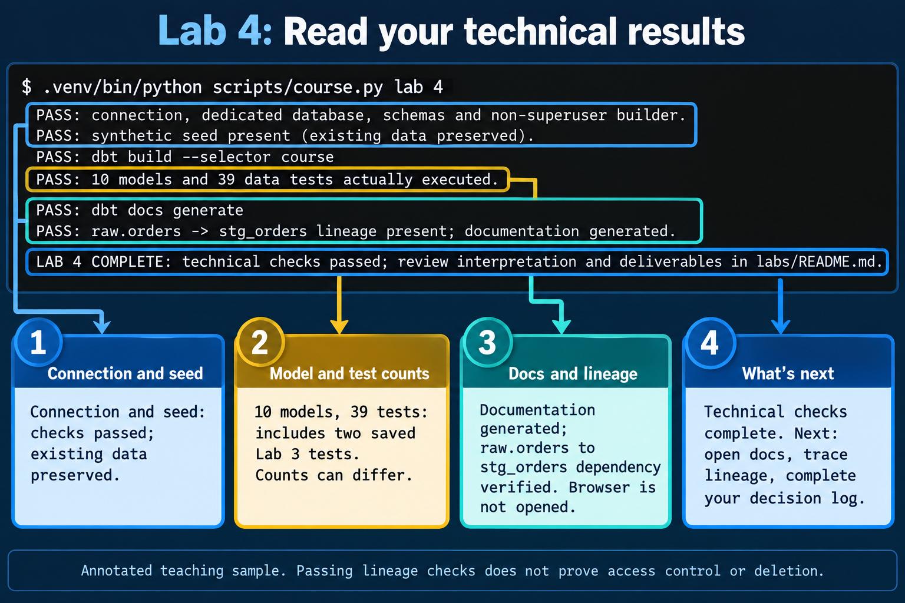
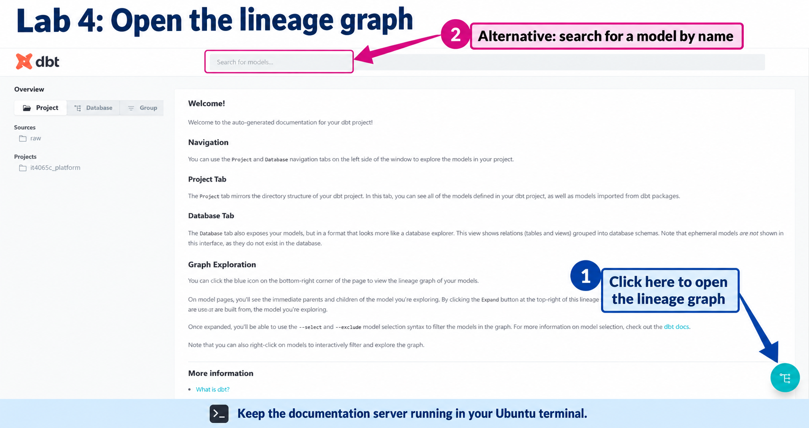
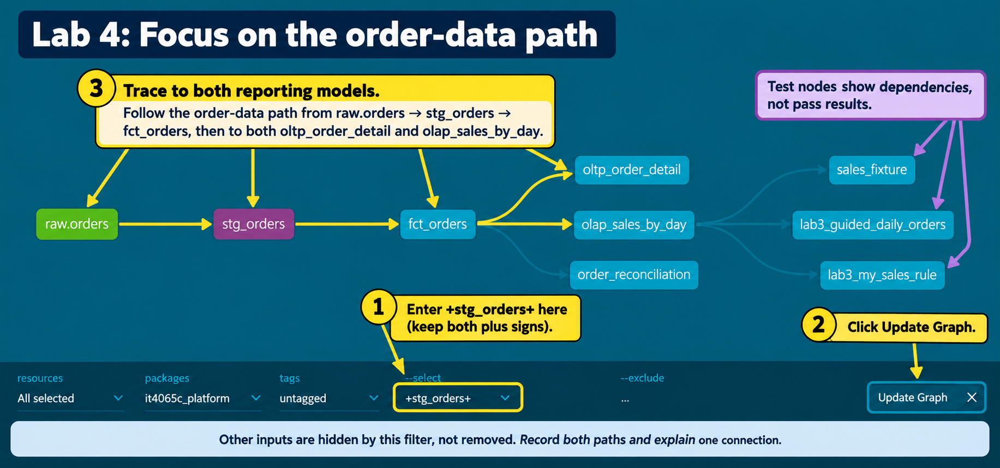
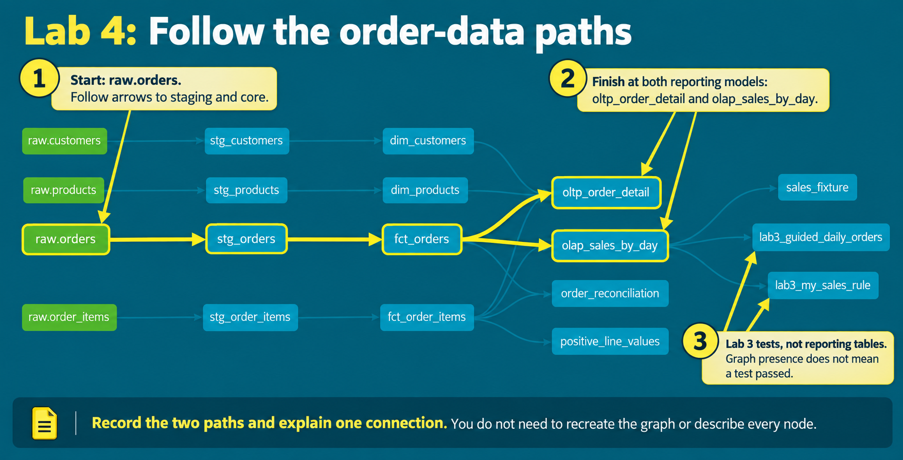

# Lab 4: Lifecycle and lineage

**Outcomes:** SLOs 2,4. **Estimated time:** 45–60 minutes; allow additional time for installation and support.
**Environment:** your dedicated local course database. Synthetic data only.

## Why this lab matters

When a source record changes or is removed, the reports built from it may also
need to change. A data administrator must know where data goes, which copies
could remain and what evidence would confirm that a change reached its destination.

In Lab 3 you built and checked sales models. In this lab you follow the connections
between those models and explain a retention scenario. These connections are
called **lineage**. You will use supplied documentation to make a lifecycle
decision, rather than assume that changing a source automatically changes every copy.

## Learning objectives

These instructor-developed lab objectives support SLOs 2 and 4. By the end of this
lab, you should be able to:

- Trace the supplied order data from its raw source through staging and core models
  to the reporting marts using generated documentation or a written path.
- Explain why a view and a stored table can respond differently to a source-data
  change, and identify downstream copies to investigate in a retention scenario.
- Complete a lifecycle decision log connecting each stage to its transformation,
  quality check, permitted role and supporting evidence.
- Distinguish a documented dependency from evidence that access restrictions or
  deletion requirements have actually been enforced.

## Skills you will practice

- Generate and navigate local dbt documentation using the supplied commands.
- Read model dependencies and describe what one row represents at each stage.
- Reason about refresh and retention responsibilities without deleting course data.
- Record a proposed action, its evidence needs and its limitations clearly.

No prior experience with lineage tools is assumed. A **dependency** means that
one model uses another source or model. A **DAG** is a diagram of these directed
connections without circular paths. You may describe the same connections in text;
you do not need to draw a diagram or write a new pipeline for this lab.

## What you will produce

- The relevant execution results from the Lab 4 runner.
- A source-to-report lineage path, shown in text or an optional screenshot.
- A completed [lifecycle decision log](_turnin_template.md), including your
  explanation of which downstream copies might remain after a source record is
  removed and what you would investigate or refresh.
- An explanation of one action the lineage diagram cannot prevent and one limit
  of your evidence. The retention scenario is a reasoning task, not an instruction
  to delete records.

Use the shared submission template to organize this evidence and include the
completed decision log. You do not need to repeat the same explanation in both.

## Concept

Lineage records dependencies: changing a raw source can affect several downstream
models. dbt’s manifest and local documentation expose these relationships. A dependency
edge describes transformation structure; it does not prove authorization or retention.

Views read underlying data when queried. Materialized tables hold copies until rebuilt
or changed. Deleting a source record therefore does not imply deletion from every
materialized downstream model, export, backup or AI training set. Trace each copy,
its owner, refresh behavior and evidence of deletion in the lifecycle decision log.

Separate acquisition, validation, transformation, permitted use, sharing, retention
and retirement. At each transition ask who approves the change and what evidence
would demonstrate it. Do not label a proposed control as implemented because it
appears in a diagram.

**Check your understanding:** the retention scenario in investigation step 4
asks you to distinguish a source change from verified downstream removal.
Optional Lab 8 extends this reasoning to a simulated restore and deletion ledger.

> **Completion:** Automation passing means the selected technical checks passed. Complete
> the independent investigation, interpretation and evidence below before submitting.

## Before you begin

We recommend completing [Lab 1](../../module1_preflight/README.md),
[Lab 2](../../module_2/M2_lab2_governance.md) and
[Lab 3](../../module_2/lab3/README.md) first. They introduce the environment,
governance decisions and sales models used here. These are earlier course
activities, not assumed prior programming qualifications.

Use the same configured environment. You do not need to repeat setup or Lab 1's
technical checks. If you are joining without an environment, follow
[Student start here](../../../STUDENT_START_HERE.md). The Lab 4 runner rebuilds
and tests the Lab 3 models before generating documentation; this is expected,
including any saved tests you added during Lab 3.

## Predict and run

Read the expected result below and predict what would fail with the wrong identity or missing input.
From the repository root in your Ubuntu terminal:

```bash
.venv/bin/python scripts/course.py lab 4
```

**Expected output after completing Lab 3 with both added test files:**

```text
PASS: connection, dedicated database, schemas and non-superuser builder.
PASS: synthetic seed present (existing data preserved).
PASS: dbt build --selector course
PASS: 10 models and 39 data tests actually executed.
PASS: dbt docs generate
PASS: raw.orders -> stg_orders lineage present; documentation generated.
LAB 4 COMPLETE: technical checks passed; review interpretation and deliverables in labs/README.md.
```



*Annotated teaching illustration based on the instructor's output, with personal
identifiers removed. Use the command above for copying. Numbers and labels explain
the highlights; the same information appears in the table below.*

**What these results mean:**

| Result | What it confirms |
| --- | --- |
| Connection PASS | The connection, dedicated database, schemas and non-superuser builder checks passed. |
| Synthetic seed PASS | The existing course source data was preserved. |
| dbt build and model/test count | Lab 4 rebuilt the Lab 3 project and its selected tests passed. It is normal to see these checks again. |
| dbt docs generate PASS | dbt generated local documentation artifacts. This does not open them in your browser. |
| Lineage PASS | The generated manifest records that `stg_orders` depends on `raw.orders`. This specific check does not verify every downstream relationship, access restriction or deletion action. |
| LAB 4 COMPLETE | The automated checks finished. The investigation and written decision log remain to be completed. |

**Your test count can differ:** the unchanged supplied project has 37 tests.
Adding the B1 guided test and the B2 test file in Lab 3 brings it to 39. Other
saved tests can increase it further. Rerunning does not duplicate tests; do not
delete your work to match a sample count.

**Checkpoint:** save the command and relevant PASS lines privately for your
submission. If you already ran the command before recording a prediction, state
that honestly. If a check fails, use Recovery before continuing; a partial set
of PASS lines does not establish completion.

Rerunning is supported; existing raw and governance data are preserved. Once the
checks pass, continue to **Hands-on investigation** to open the documentation
and trace the downstream path yourself. No setup rerun is needed.

## Hands-on investigation

### 1. Open the local documentation

After the Lab 4 checks pass, run this command from the repository root:

```bash
.venv/bin/python scripts/course.py docs
```

**Expected:** the connection PASS line is followed by:

```text
Starting local documentation server. Open http://127.0.0.1:8080 in your browser.
Keep this terminal open. Press Ctrl+C when finished to stop the server.
Startup may take a moment; these instructions do not confirm the page is ready.
```

The terminal remains busy while serving documentation. The runner captures dbt's
server output, so no further message may appear. It does not automatically open
a browser. Opening the page successfully confirms that it is responding.

Leave that terminal running. On the same computer, open your browser and enter:

```text
http://127.0.0.1:8080
```

Expect the local dbt documentation site with a project/model catalog. In WSL, try
this address in your Windows browser. If the page does not load, confirm the
terminal is still running and Lab 4 generated the docs. If the command exits with
an error, inspect `.local/dbt-last.log` privately; do not change the server to a
public address to work around the error. Report a connection problem if it persists.

### 2. Follow the order-data path

The landing page has a welcome message, a model search box at the top and a
project catalog on the left. **Click the circular graph button at the bottom-right
of the documentation page** (callout 1 below). It opens the **Lineage Graph**.
Keep the Ubuntu server terminal running while you use the page.



*Annotated teaching illustration based on the instructor's screenshot. Browser
toolbars and personal bookmarks have been removed. Button placement can vary with
window size or version; the model search offers an alternative route.*

**Choose one viewing route:** use the focused view below to reduce clutter, or
follow the same paths in the full graph. Both satisfy this step; no extra
submission is required for trying both.

**Focused view (alternative navigation):**

1. In the open Lineage Graph, locate the **`--select`** field along the bottom.
   If the filter bar is not visible, use the graph's expand control at the top-right.
2. Replace the selection text with the following value, keeping both plus signs.
   This is a graph filter, **not a terminal command**:

   ```text
   +stg_orders+
   ```

3. Leave **`--exclude`** empty and click **Update Graph**. Keep the resource and
   package filters at their defaults, as shown below.



*Annotated teaching illustration based on the instructor's focused graph. It
highlights the controls and paths; actual styling may vary. Equivalent instructions
and paths are provided in text.*

The leading `+` includes upstream dependencies and the trailing `+` includes
downstream dependents of `stg_orders`. You should see `raw.orders`, `stg_orders`,
`fct_orders`, both reporting models and dependent tests. Other inputs, such as
customer and item data, are **hidden by this filter, not removed from the project**.
To return to the full view, clear the `--select` field and click **Update Graph**.

<details>
<summary>Optional reference: the full graph with the same paths highlighted</summary>

In the graph, find `raw.orders` on the left. Follow its arrows to `stg_orders`,
then `fct_orders`. From there, follow the two branches to `olap_sales_by_day` and
`oltp_order_detail`. The highlighted paths below show where to look; inspect the
same connections in your own graph.



*Annotated teaching illustration, not evidence of a new execution. Numbered
callouts and the text paths below provide the same guidance as the colors.*

</details>

The `lab3_guided_daily_orders` and `lab3_my_sales_rule` nodes are tests, not
reporting tables. Their presence documents dependencies; it does not show whether
they passed. Your saved Lab 3 test results provide that execution evidence.
Other test nodes may also be visible. You do not need to describe every node or
recreate the graph.

If you prefer the catalog route, close the graph using the bottom-right **X**,
then use model search to find `stg_orders`, `fct_orders` and both reporting models.
Inspect their SQL references. The text-based route below is also acceptable.

Use these paths as a guide, and check them against the model references:

```text
raw.orders -> stg_orders -> fct_orders -> olap_sales_by_day
raw.orders -> stg_orders -> fct_orders -> oltp_order_detail
```

The arrows mean “used by.” These are order-data paths, not a complete graph: the
marts also use other models, including item data. For a text-based route, read
[order staging](../../../dbt/it4065c_platform/models/staging/lab3/stg_orders.sql),
[the order model](../../../dbt/it4065c_platform/models/core/lab3/fct_orders.sql),
[the daily mart](../../../dbt/it4065c_platform/models/marts/lab3/olap_sales_by_day.sql)
and [the detail mart](../../../dbt/it4065c_platform/models/marts/lab3/oltp_order_detail.sql).
`source` identifies raw input and `ref` identifies another model used by the query.

**Keep for submission:** record the two paths in text and one sentence explaining a
reference you inspected. A cropped lineage screenshot is an optional alternative
to the text paths; keep the explanatory sentence either way. If the browser route
failed, state that you used the supplied SQL files instead. Then continue to step 3 to complete
your private lifecycle decision log.

### 3. Complete your private decision log

When finished browsing, return to the server terminal and press **Ctrl+C** to stop
it and regain the shell prompt. Expected:

```text
Documentation server stopped. You can continue with the lab.
```

A terminal may also display `^C`, meaning you pressed Ctrl+C. Older checkouts may
show a traceback ending in `KeyboardInterrupt` instead; when the shell prompt
returns after your intentional interruption, this is not a failed data test.
Update the checkout for the clearer shutdown message; no setup rerun is needed.

Then run these commands one at a time:

```bash
mkdir -p .local
```

```bash
cp -i labs/module_3/lab4/_turnin_template.md .local/lab4-decision-log.md
```

```bash
nano .local/lab4-decision-log.md
```

A successful copy is normally silent. If prompted to overwrite existing work,
answer `n` to keep it, then review your existing log. Edit only the private copy.
**Expected in the editor:** a worksheet with a completed Raw example, the model
names and grains already filled in, prompts for three student rows, and three
retention questions. This is written work, not SQL to execute.

Keep the Raw row labeled as the supplied example. Complete the Staging, Core and
Marts rows for the path ending at `olap_sales_by_day`, replacing each `[Write: ...]`
prompt with your explanation. Record your checked paths and explanatory sentence
in section 1 of the same worksheet so the evidence stays together:


| Column | What to write |
| --- | --- |
| Input and grain | Model/source name and what one row represents |
| Transformation | What changes at that stage; raw input can say “stored source records” |
| Quality check | A relevant observed test, or a proposed check clearly labeled as proposed |
| Permitted role | The role you propose should use the data; label it proposed unless access was actually tested |
| Evidence and limitation | The file, output or observation supporting the entry, and what it cannot establish |

The Raw example uses `lab2_seed.sql` as evidence of the source fixture and explicitly
says that it does not prove access restrictions. Apply the same distinction to
your three rows. Keep the `|` separators when editing the table; spacing need not
align. You may instead write one labeled paragraph per stage using the column
names, or complete the worksheet in a word processor.

**Already have the older blank template?** Updating the repository does not update
your private `.local` copy. Keep any work you have written. Open the revised
[worksheet](_turnin_template.md) and transfer its prompts into your private notes,
or copy it to a new private filename; do not overwrite completed work.

Save with **Ctrl+O**, **Enter**, then exit with **Ctrl+X**. This saves your notes;
it does not execute SQL. No screenshot of the editor is required.

### 4. Explain the retention scenario

This is a written scenario: **do not delete data or run a refresh for this task.**
Suppose an approved retention decision removes an order from `raw.orders`.
Complete the three labeled answer spaces in section 3 of your private worksheet:

1. Which downstream stored tables could still contain the order or its contribution
   to a total? Name the affected models along the paths you traced.
2. What would you propose refreshing, in what dependency order, and what query or
   comparison would you use to check the result?
3. What remains unproven? Include one action a lineage diagram cannot prevent,
   such as an authorized reader exporting a copy, and the separate evidence needed.

The supplied [project configuration](../../../dbt/it4065c_platform/dbt_project.yml)
sets staging models to views and core/mart models to stored tables. A view reads
its underlying data when queried; a stored table does not automatically rebuild
when an upstream record changes. Exports and backups need separate investigation.
Describe your refresh and checks as **proposed**, not demonstrated deletion.

**Investigation complete:** retain the checked paths, the four-row decision log
and these three scenario answers. They are the interpretation and transfer work
for this lab; no separate repeated essay is required.

## Submit

Use the [submission template](../../../submissions/template.md). Include the command,
relevant PASS lines, your prediction (or note that you already ran it), the checked
paths and explanatory sentence from step 2, and the decision log with the three
scenario answers from steps 3–4. These include your interpretation and limitations;
do not repeat them in a second essay. A screenshot is optional; crop/redact identities
and never include configuration secrets. Submit privately through your course system;
independent learners keep their work locally. Execution success alone does not
complete the reasoning task.

Rubric: correct execution/evidence 25%; accurate interpretation 35%; transfer and
tradeoff reasoning 30%; clarity and evidence limitations 10%.

## Recovery

Use the [setup troubleshooting table](../../../docs/setup.md). Read errors before retrying;
never delete tests or change authentication to make a result pass. There is no
automatic destructive reset. For an isolated new start use a new DB/user pair.

[Back to all labs](../../../labs/README.md)

---

Author: [Isaac K. Nti](../../../AUTHORS.md). [Citation and reuse terms](../../../CITATION.md).
