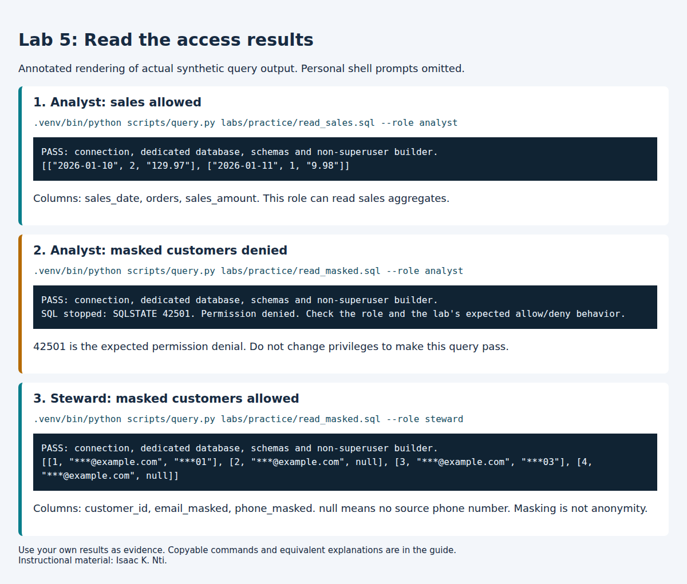

# Lab 5: Access control and masking

**Outcomes:** SLO 5. **Estimated time:** 60–90 minutes; allow additional time for installation and support.
**Environment:** your dedicated local course database. Synthetic data only.


## Why this lab matters

The same database can expose different information to different people. You will test access using two actual logins and explain why a denied query can be the correct result.

## Learning objectives

These instructor-developed objectives support the outcomes listed above. You will:

- Distinguish authentication from authorization using observed query results.
- Explain what the analyst and steward can read, and what masking still reveals.
- Propose a smaller data view for a stated business purpose.

## Skills you will practice

Predict access, run supplied read-only SQL, interpret SQLSTATE 42501, and justify data minimization.

## Concept

Authentication establishes the login. Authorization determines which operations it
can perform. The lab opens separate connections for the analyst and steward; successful
builder queries are not proof that those reader identities have the same access.

The builder owns the raw data and controlled views. Readers receive schema usage and
SELECT on specified views, but no raw schema access or membership in the builder role.
The analyst sees sales aggregates; the steward can additionally use masked customer
fields. A 42501 response confirms an authorization denial. A wrong-password error or
missing-table error would not establish the intended access boundary.

The views use their owner’s access to expose a deliberately restricted projection.
Granting access to an owner-controlled view therefore requires reviewing its entire
query. Adding a raw column later could expose it to every existing reader of that view.
The owner is trusted; the design does not protect raw data from its own owner.

Masking is data minimization, not proof of anonymity. Domains, suffixes, identifiers
and joinable patterns can still reveal information. Unkeyed hashes of predictable
identifiers are not a safe substitute for an access policy.

**Check your understanding:** Predict all three commands in the practice guide before
running them. Explain both the role grant and the view projection behind each result.

> **Completion:** Automation passing means the environment checks worked. Complete
> the independent investigation, interpretation and evidence below before submitting.

## Before you begin

Complete [Lab 4](../../module_3/lab4/README.md) first for lineage context;
[Lab 2](../../module_2/M2_lab2_governance.md) introduces the source fields.
Run each command separately from the repository root in Ubuntu. Keep the same
configured environment; do not repeat setup. If you need an environment, use
[Student start here](../../../STUDENT_START_HERE.md). No prior SQL qualification
is assumed. Copy commands from code blocks; write explanations in your private
submission, not in the terminal.

## Part A: Follow the supplied access checks

### A1. Build and check the access rules

```bash
.venv/bin/python scripts/course.py lab 5
```

Expected with the supplied data:

```text
PASS: connection, dedicated database, schemas and non-superuser builder.
PASS: synthetic seed present (existing data preserved).
PASS: nine access checks using separate authenticated connections, including escalation denials.
LAB 5 COMPLETE: technical checks passed; review interpretation and deliverables in labs/README.md.
```

This configures the teaching views and grants, then checks nine outcomes. It does
not complete your explanation. Rerunning preserves existing raw/governance data.

### A2. Read sales as the analyst

Predict allowed or denied in your notes, then run:

```bash
.venv/bin/python scripts/query.py labs/practice/read_sales.sql --role analyst
```

After the connection PASS line, expect these rows (whitespace may differ):

```json
[["2026-01-10", 2, "129.97"], ["2026-01-11", 1, "9.98"]]
```

The positions mean **sales_date, orders, sales_amount**. Quoted decimal amounts
are JSON representations of exact database decimals. This analyst view has three
columns; it is not the five-column Lab 3 mart. Record that the analyst can read
these aggregates. If your source fixture differs, explain the resulting values.

### A3. Try masked customer data as the analyst

```bash
.venv/bin/python scripts/query.py labs/practice/read_masked.sql --role analyst
```

Expected after the connection PASS line:

```text
SQL stopped: SQLSTATE 42501. Permission denied. Check the role and the lab's expected allow/deny behavior.
```

**This expected denial is successful protection.** The command exits unsuccessfully;
continue to A4 only if the code is **42501**. The initial connection PASS checks
the builder configuration; it does not grant the analyst access to this view.
A missing table or wrong password is a different error and needs investigation.

### A4. Read the same view as the steward

```bash
.venv/bin/python scripts/query.py labs/practice/read_masked.sql --role steward
```

After the connection PASS line, expect:

```json
[[1, "***@example.com", "***01"], [2, "***@example.com", null],
 [3, "***@example.com", "***03"], [4, "***@example.com", null]]
```

Positions mean **customer_id, email_masked, phone_masked**. `null` means the source
phone number is missing; it is not an error. The domain, suffix and customer ID
remain visible. These synthetic values illustrate partial masking, not anonymity.



This visual renders the observed results without personal terminal details.
Copy commands from the text above; use your own results as submission evidence.

## Part B: Explain and propose a different access decision

No new SQL file or database edits are required for this part.

1. In your private submission, make a three-row table with **command/role,
   prediction, actual result, explanation** for A2–A4. If you already ran a
   command, label your prediction as a later interpretation.
2. Read the supplied [view definitions](02_build_safe_objects.sql) and
   [grants](03_rbac_and_grants.sql). For each result, identify the view being
   requested and whether that reader has SELECT permission. You only need to
   inspect those statements, not understand every SQL line.
3. Propose a view for a fictional manager who needs weekly sales trends.
   State which fields and level of detail they need, which customer fields you
   would omit, and why. Label this **proposed**, not implemented. Explain one
   remaining privacy risk and why any error is not equivalent to a 42501 denial.

**Part B complete:** you have three interpreted outcomes and one justified access
proposal. You do not need to recreate the runner's nine internal checks manually.

## Submit

Use the [submission template](../../../submissions/template.md). Include A1's
completion evidence, your A2–A4 table with the relevant results, and the Part B
proposal and limitation. Text output is sufficient; screenshots are optional.
Do not submit `.env`, credentials or personal terminal prompts. Submit through the
LMS or retain privately for independent study. Do not repeat the same explanation
in a second essay.

Rubric: correct execution/evidence 25%; accurate interpretation 35%; transfer and
tradeoff reasoning 30%; clarity and evidence limitations 10%.

## Recovery

Use the [setup troubleshooting table](../../../docs/setup.md). Read errors before retrying;
never delete tests or change authentication to make a result pass. There is no
automatic destructive reset. For an isolated new start use a new DB/user pair.

[Back to all labs](../../../labs/README.md)

---

Author: [Isaac K. Nti](../../../AUTHORS.md). [Citation and reuse terms](../../../CITATION.md).
